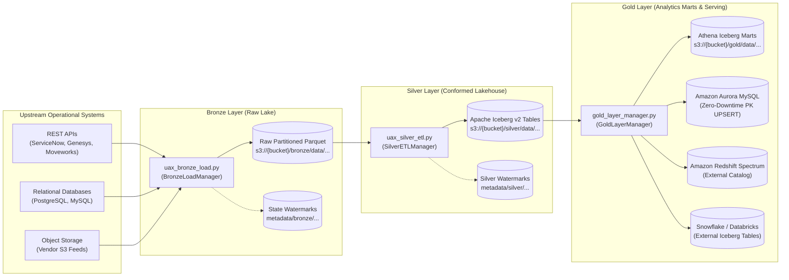

# Enterprise Medallion Data Lakehouse Platform

An enterprise-grade, config-driven, multi-target Medallion Lakehouse platform built on **AWS Glue**, **Apache Iceberg (v2)**, **AWS Secrets Manager**, and **Amazon Athena**, providing high-throughput incremental ingestion, conformed dimensional transformation, and multi-engine serving across **Amazon Aurora MySQL**, **Amazon Redshift Spectrum**, **Snowflake**, and **Databricks**.

---

## 🏗️ Architectural Overview

The platform implements the **Medallion Lakehouse Architecture** (Bronze $\to$ Silver $\to$ Gold) to decouple raw source ingestion from conformed business modeling and downstream analytical consumption:



---

## 📚 Comprehensive Documentation Suite

For granular engineering specifications, execution lifecycles, configuration blueprints, and developer guides, refer to the documentation suite in [`docs/`](docs/):

| Layer / Topic | Documentation Link | Description |
| :--- | :--- | :--- |
| **System Architecture** | [Architecture Blueprint](docs/ARCHITECTURE.md) | Universal architectural specification, execution lifecycle, and cross-layer security. |
| **Bronze Layer** | [Bronze Low-Level Guide](docs/bronze/BRONZE_LAYER.md) | Ingestion mechanics, connector protocols, OAuth2 grant types, and S3 state watermarks. |
| **Bronze Config** | [Bronze Config Blueprint](docs/bronze/CONFIG_BLUEPRINT.md) | Line-by-line configuration parameter blueprint and source connection templates. |
| **Silver Layer** | [Silver Low-Level Guide](docs/silver/SILVER_LAYER.md) | Apache Iceberg v2 storage, deduplication windowing, SCD1, SCD2, and schema evolution. |
| **Silver Config** | [Silver Config Blueprint](docs/silver/CONFIG_BLUEPRINT.md) | Declarative transformation, deduplication, and Iceberg table configuration reference. |
| **Gold Layer** | [Gold Low-Level Guide](docs/gold/GOLD_LAYER.md) | Multi-target serving, Aurora MySQL zero-downtime PK upsert, Athena Iceberg schema alignment, and initial CSV migration. |
| **Gold Config** | [Gold Config Blueprint](docs/gold/CONFIG_BLUEPRINT.md) | Business mart definition, SQL linkage, and downstream adapter configuration reference. |
| **Developer Onboarding** | [Onboarding & Operations Guide](docs/ONBOARDING_GUIDE.md) | Environment setup, CLI reference, Secrets Manager schemas, and step-by-step entity addition. |

---

## 📁 Repository Directory Structure

```text
Data-pipeline/
├── bronze/                             # Bronze Ingestion Engine
│   └── script/
│       ├── config/
│       │   └── bronze_config.json      # Ingestion configuration blueprint
│       ├── config_loader.py            # Centralized config parser & {env} interpolator
│       ├── connectors/                 # Modular upstream connectors
│       │   ├── base_connector.py       # Abstract connector base class
│       │   ├── database_connector.py   # JDBC streaming database connector
│       │   ├── genesys_connector.py    # Genesys Cloud Analytics API connector
│       │   ├── http_client.py          # Resilient HTTP client with retry & rate limiting
│       │   ├── moveworks_connector.py  # Moveworks Enterprise API connector
│       │   ├── oauth.py                # OAuth2 client (client_credentials, password, refresh)
│       │   ├── s3_connector.py         # S3 file feed connector (CSV, JSON, Parquet)
│       │   └── servicenow_connector.py # ServiceNow REST Table API connector
│       └── uax_bronze_load.py          # Main Bronze execution script
├── silver/                             # Silver Conformation & Iceberg Engine
│   └── script/
│       ├── config/
│       │   └── silver_config.json      # Silver transformation & Iceberg merge configuration
│       ├── custom_transforms/          # Pluggable PySpark transformation scripts
│       ├── silver_config_loader.py     # Silver config parser & cache manager
│       ├── transformer.py              # Declarative transformation rules engine
│       └── uax_silver_etl.py           # Main Silver PySpark Iceberg execution script
├── gold/                               # Gold Analytics Marts & Multi-Target Serving Engine
│   ├── initial_exports/                # Historical CSV data migration drop directory
│   ├── query/                          # Business SQL transformation queries
│   │   ├── genesys/
│   │   │   └── conversations.sql       # Genesys conversation dimensional mart query
│   │   └── moveworks/
│   │       └── interactions.sql        # Moveworks interaction mart query
│   └── script/
│       ├── adapters/                   # Multi-target serving database connectors
│       │   ├── aurora.py               # Aurora MySQL isolated staging & PK UPSERT adapter
│       │   ├── databricks.py           # Databricks Unity Catalog Iceberg adapter
│       │   ├── redshift.py             # Amazon Redshift Spectrum external catalog adapter
│       │   └── snowflake.py            # Snowflake external Iceberg table adapter
│       ├── config/
│       │   └── gold_config.json        # Multi-target serving configuration blueprint
│       ├── custom_transforms/          # Domain-specific PySpark transformation hooks
│       ├── gold_config_loader.py       # Gold configuration loader & cache manager
│       ├── gold_initial_load.py        # Historical CSV parser, validator & auto-archiver
│       └── gold_layer_manager.py       # Master Gold orchestration engine
└── docs/                               # Enterprise Documentation Suite
│   ├── ARCHITECTURE.md                 # System-wide architectural blueprint
│   ├── ONBOARDING_GUIDE.md             # Developer setup, CLI args & onboarding recipe
│   ├── bronze/
│   │   ├── BRONZE_LAYER.md             # Bronze low-level execution & auth guide
│   │   └── CONFIG_BLUEPRINT.md         # Bronze configuration parameter reference
│   ├── silver/
│   │   ├── SILVER_LAYER.md             # Silver low-level execution & Iceberg guide
│   │   └── CONFIG_BLUEPRINT.md         # Silver configuration parameter reference
│   └── gold/
│       ├── GOLD_LAYER.md               # Gold low-level execution & multi-target guide
│       └── CONFIG_BLUEPRINT.md         # Gold configuration parameter reference
```

---

## 🚀 Execution Quickstart

Each pipeline layer can be triggered independently via Python CLI or deployed as AWS Glue Jobs:

### 1. Ingest Raw Data (Bronze)
```bash
python3 bronze/script/uax_bronze_load.py \
  --CONFIG_S3_PATH "s3://uax-datalake-config-dev/bronze/config/bronze_config.json" \
  --ENV "dev" \
  --SOURCE_SYSTEM "servicenow" \
  --TABLE_NAME "incident"
```

### 2. Conform & Merge to Apache Iceberg (Silver)
```bash
python3 silver/script/uax_silver_etl.py \
  --CONFIG_S3_PATH "s3://uax-datalake-config-dev/silver/config/silver_config.json" \
  --ENV "dev" \
  --SOURCE_SYSTEM "servicenow" \
  --TABLE_NAME "tbl_incident"
```

### 3. Build Marts & Sync Serving Targets (Gold)
```bash
python3 gold/script/gold_layer_manager.py \
  --CONFIG_S3_PATH "s3://uax-datalake-config-dev/gold/config/gold_config.json" \
  --ENV "dev" \
  --SOURCE_SYSTEM "moveworks" \
  --TABLE_NAME "interactions"
```

For detailed CLI argument definitions and onboarding instructions, consult the [Onboarding & Operations Guide](docs/ONBOARDING_GUIDE.md).
