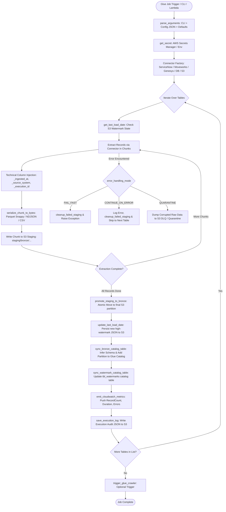

# 🔍 Bronze Layer: Low-Level Technical & Code Execution Guide

This document provides an exhaustive, low-level technical explanation of how the Bronze Ingestion Layer operates within the UAX Data Lake Pipeline. It details the execution lifecycle, internal function call stacks, data flow, memory management, catalog synchronizations, and failure containment strategies implemented in [uax_bronze_load.py](file:///Users/nilkamalmahato/Documents/Data-pipeline/bronze/script/uax_bronze_load.py) and supporting modules.

---

## 🏗️ 1. High-Level Architecture & Execution Flow

The Bronze layer implements a **Modular Connector Factory Pattern** with **Chunked Streaming Ingestion**, **Atomic Two-Phase Staging**, and **Instant Glue Data Catalog Synchronization**.



---

## ⚙️ 2. Core Execution Lifecycle (Step-by-Step)

### Step 1: Argument Resolution & Configuration Loading
- **Function**: `parse_arguments()` ([uax_bronze_load.py:L163](file:///Users/nilkamalmahato/Documents/Data-pipeline/bronze/script/uax_bronze_load.py#L163))
- **Configuration Loader**: [config_loader.py](file:///Users/nilkamalmahato/Documents/Data-pipeline/bronze/script/config_loader.py)
- **Hierarchy of Precedence**:
  1. **CLI / Glue Job Arguments**: (e.g. `--SOURCE_SYSTEM`, `--TABLE_NAME`, `--FULL_REFRESH`, `--GLUE_DATABASE`)
  2. **Central S3 Config File**: `bronze_config.json` (loaded from `--CONFIG_S3_PATH` or default S3 path)
  3. **Hardcoded Fallbacks**: Safe operational defaults.

```python
# Low-level resolution example:
source_system = get_cli_arg('SOURCE_SYSTEM', 'source_system')
glue_database_name = (
    get_cli_arg('GLUE_DATABASE', 'glue_database', 'GLUE_DB_NAME', 'glue_db_name')
    or catalog_config.get('database_name')
)
```

### Step 2: Secrets & Credential Resolution
- **Function**: `get_secret(secret_name)` ([uax_bronze_load.py:L127](file:///Users/nilkamalmahato/Documents/Data-pipeline/bronze/script/uax_bronze_load.py#L127))
- Retrieves API credentials, OAuth client secrets, or database passwords from **AWS Secrets Manager**.
- Automatically extracts connection parameters (`base_url`, `client_id`, `client_secret`, `username`, `password`).
- Provides fallback to local environment variables if running in local unit test mode.

### Step 3: Connector Instantiation via Factory Pattern
- Dynamically resolves and instantiates the target connector based on `SOURCE_SYSTEM`:
  - `servicenow` -> `ServiceNowConnector` ([servicenow.py](file:///Users/nilkamalmahato/Documents/Data-pipeline/bronze/script/connectors/servicenow.py))
  - `moveworks` -> `MoveworksConnector` ([moveworks.py](file:///Users/nilkamalmahato/Documents/Data-pipeline/bronze/script/connectors/moveworks.py))
  - `genesys` -> `GenesysConnector` ([genesys.py](file:///Users/nilkamalmahato/Documents/Data-pipeline/bronze/script/connectors/genesys.py))
  - `database` -> `DatabaseConnector` ([database.py](file:///Users/nilkamalmahato/Documents/Data-pipeline/bronze/script/connectors/database.py))
  - `s3_file` -> `S3FileConnector` ([s3_file.py](file:///Users/nilkamalmahato/Documents/Data-pipeline/bronze/script/connectors/s3_file.py))

### Step 4: Watermark Retrieval (State Management)
- **Function**: `get_last_load_date()` ([uax_bronze_load.py:L545](file:///Users/nilkamalmahato/Documents/Data-pipeline/bronze/script/uax_bronze_load.py#L545))
- State File S3 Location: `s3://<bronze_bucket>/metadata/bronze/<source_system>/<table_name>_watermark.json`
- **Logic**:
  - If `--FULL_REFRESH true` is passed: Ignores the stored watermark and begins extraction from epoch (`1970-01-01T00:00:00Z`) or initial configured start time.
  - If incremental load: Reads the JSON state file and extracts `last_load_date` or `last_watermark_value`.
  - If state file does not exist (initial table run): Defaults to `table_configs.<table_name>.initial_load_date` or `1970-01-01T00:00:00Z`.

### Step 5: Streaming Chunk Extraction & In-Memory Processing
- **Callback**: `chunk_writer_callback(records_chunk, part_num)` ([uax_bronze_load.py:L1139](file:///Users/nilkamalmahato/Documents/Data-pipeline/bronze/script/uax_bronze_load.py#L1139))
- Connectors emit batches of records (e.g. 5,000 to 10,000 records per chunk) rather than loading entire datasets into memory.
- For each record, four **Technical Audit Columns** are injected:
  1. `_ingested_at`: UTC ISO timestamp of ingestion run (e.g. `2026-09-08T16:00:00Z`).
  2. `_source_system`: Source identifier (e.g. `servicenow`).
  3. `_source_table`: Raw table name (e.g. `incident`).
  4. `_execution_id`: Unique UUID representing the Glue Job run.

### Step 6: Serialization & Two-Phase Staging Write
- **Serialization**: `serialize_chunk_to_bytes()` ([uax_bronze_load.py:L476](file:///Users/nilkamalmahato/Documents/Data-pipeline/bronze/script/uax_bronze_load.py#L476))
  - Uses `pyarrow` to convert Python dictionaries to an Arrow Table, applying Apache Parquet format with Snappy compression (or NDJSON/CSV if configured).
- **Staging Location**:
  `s3://<bronze_bucket>/staging/bronze/<execution_id>/<source_system>/<table_name>/part-00000.parquet`
- **Atomic Promotion**: `promote_staging_to_bronze()` ([uax_bronze_load.py:L632](file:///Users/nilkamalmahato/Documents/Data-pipeline/bronze/script/uax_bronze_load.py#L632))
  - Copies all staged chunk files from `staging/` to the final Hive-partitioned path:
    `s3://<bronze_bucket>/bronze/data/<source_system>/<table_name>/_ingested_at=<TIMESTAMP>/`
  - Deletes staging files immediately upon successful copy.
  - If any failure occurs prior to promotion, `cleanup_failed_staging()` deletes all staged chunks, preventing corrupt or orphan files in Bronze.

### Step 7: Dual-Layer State Persistence
Upon successful data promotion:
1. **S3 State File**: `update_last_load_date()` writes updated watermark JSON to:
   `s3://<bronze_bucket>/metadata/bronze/<source_system>/<table_name>_watermark.json`
2. **Glue Catalog Watermark Table**: `sync_watermark_catalog_table()` updates the centralized `uax_datalake_db_dev.tbl_watermarks` table with `last_load_date`, `record_count`, `duration_seconds`, and `status`.

### Step 8: AWS Glue Data Catalog Auto-Sync (Instant Table & Partition Registration)
- **Function**: `sync_bronze_catalog_table()` ([uax_bronze_load.py:L766](file:///Users/nilkamalmahato/Documents/Data-pipeline/bronze/script/uax_bronze_load.py#L766))
- Automatically creates or updates the table in AWS Glue Data Catalog:
  - Database: `uax_datalake_db_dev`
  - Table Name: `raw_tbl_<table_name>` (e.g. `uax_datalake_db_dev.raw_tbl_incident`)
  - Classification: `parquet`
  - Partition Key: `_ingested_at` (Type: `string`)
  - SerDe: `org.apache.hadoop.hive.ql.io.parquet.serde.ParquetHiveSerDe`
- **Instant Partition Registration**:
  Calls `glue_client.create_partition()` directly for `_ingested_at=<TIMESTAMP>`. This makes the newly loaded data queryable in Amazon Athena and downstream Silver PySpark jobs immediately without waiting for a crawler!

### Step 9: Crawler Triggering (Optional)
- **Function**: `trigger_glue_crawler()` ([uax_bronze_load.py:L996](file:///Users/nilkamalmahato/Documents/Data-pipeline/bronze/script/uax_bronze_load.py#L996))
- If `--TRIGGER_CRAWLER true` is set, calls `glue:StartCrawler` for reconciliation. Handles `CrawlerRunningException` gracefully without failing the job.

### Step 10: Observability & Auditing
- **CloudWatch Metrics**: `emit_cloudwatch_metrics()` pushes custom metrics under namespace `UAX/DataPipeline/Ingestion`:
  - `IngestionRecords`
  - `IngestionDuration`
  - `IngestionErrors`
- **Audit Execution Log**: `save_execution_log()` writes an execution summary JSON report to `s3://<bronze_bucket>/logs/bronze/<source_system>/<table_name>/<execution_id>.json`.

---

## 📂 3. Directory & S3 Path Structure

```
s3://<data-lake-bucket>/
│
├── bronze/
│   └── data/
│       └── <source_system>/                 # e.g., servicenow, moveworks
│           └── <table_name>/                # e.g., incident, interactions
│               └── _ingested_at=20260908T160000Z/
│                   ├── part-00000.parquet
│                   └── part-00001.parquet
│
├── staging/
│   └── bronze/
│       └── <execution_id>/                  # Ephemeral staging during active ingestion
│
├── metadata/
│   └── bronze/
│       └── <source_system>/
│           └── <table_name>_watermark.json  # High-watermark JSON tracking file
│
└── logs/
    └── bronze/
        └── <source_system>/
            └── <table_name>/
                └── <execution_id>.json      # Run audit metrics & status
```

---

## 🔒 4. Memory & Resource Safety Details

1. **Streaming Paginated Ingestion**:
   Connectors never accumulate complete upstream datasets in memory. Instead, chunks of records (configurable via `chunk_size`, default 5,000) are extracted, serialized, and streamed to S3.
2. **Garbage Collection Optimization**:
   Record chunks are dereferenced and explicitly collected after serialization, keeping PySpark / Python memory footprints well under Glue DPU limits (standard 2 to 4 DPUs).
3. **Atomic Two-Phase Staging**:
   Direct-to-partition writes are avoided. By writing to an ephemeral staging prefix and copying only on complete success, partial network drops or API aborts will never leave partial, broken Parquet files in queryable Bronze partitions.
