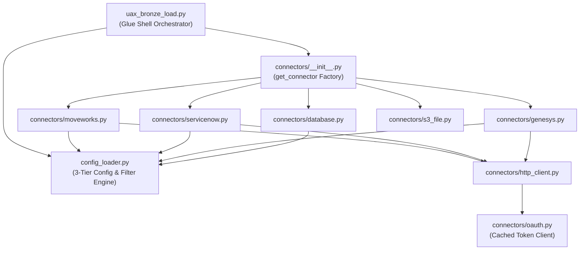
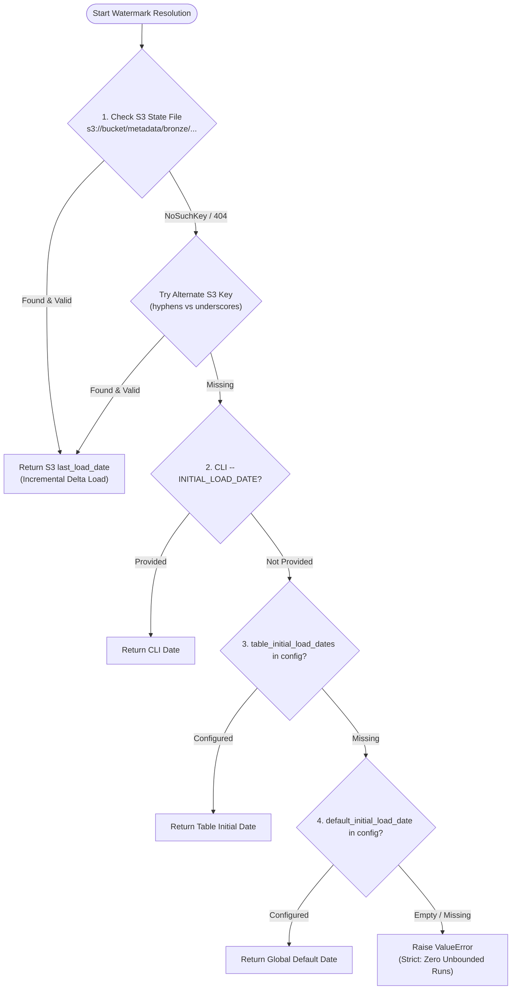

# Bronze Layer — Low-Level Code Mechanics

> Audience: Engineers modifying, extending, or debugging Bronze pipeline code.  
> Assumes familiarity with `BRONZE_LAYER_GUIDE.md`.

---

## 1. Module Dependency Map



---

## 2. `uax_bronze_load.py` — Function Reference

### `parse_arguments() → dict`
**Lines 164–375**

Parses `sys.argv` with a custom key=value and positional parser designed specifically for AWS Glue Python Shell jobs (which pass parameters in `--KEY value` format).

**5-tier parameter precedence (CLI > Table Config > Source Config > Default > Runtime):**
```python
# In parse_arguments():
upper_bound_cli = get_cli_arg('UPPER_BOUND')

# In main() table processing loop (table-wise resolution):
table_upper_bound = ConfigLoader.get_table_upper_bound(
    source_system=source_system,
    table_name=api_table_name,
    cli_upper_bound=upper_bound_cli,
    source_config=source_config
)
```

**Strict validation — raises `ValueError` if:**
- `--SOURCE_SYSTEM` is missing.
- `BRONZE_BUCKET` is not resolvable from CLI, config, or environment.
- `database_name` or `table_prefix` is empty when `GLUE_CATALOG_ENABLED=true`.
- `watermark_table_name` is empty when `SYNC_WATERMARK_TABLE=true`.

**Returns dict keys:**
```
JOB_NAME, SOURCE_SYSTEM, TABLE_LIST, CUSTOM_QUERY, SECRET_NAME, ENV,
BRONZE_BUCKET, STATE_BUCKET, BRONZE_DATA_PREFIX, INITIAL_LOAD_DATE_CLI,
UPPER_BOUND, S3_CHUNK_SIZE, OUTPUT_FORMAT, PARQUET_COMPRESSION,
ERROR_HANDLING_MODE, CLOUDWATCH_NAMESPACE, GLUE_CATALOG_ENABLED,
GLUE_DATABASE_NAME, GLUE_TABLE_PREFIX, BRONZE_CRAWLER_NAME,
TRIGGER_CRAWLER, SYNC_WATERMARK_TABLE, WATERMARK_TABLE_NAME,
SOURCE_CONFIG, PIPELINE_DEFAULTS
```

---

### `get_secret(secret_name) → dict`
**Lines 127–161**

Retrieves credentials from AWS Secrets Manager.

**`_val` sanitizer:**
```python
def _val(key: str, default: str) -> str:
    v = sec_payload.get(key)
    if v and str(v).strip() and not str(v).startswith("CHANGE_ME") and not str(v).startswith("YOUR_"):
        return str(v).strip()
    return default
```
Any placeholder starting with `"CHANGE_ME"` or `"YOUR_"` is treated as unconfigured and falls back to `default`, preventing accidental authorization failures caused by documentation template values.

---

### `get_last_load_date(...) → str`
**Lines 521–573**

Resolves the extraction start watermark (`lower_bound`):


---

### `update_last_load_date(...) → None`
**Lines 576–618**

Persists updated `watermark.json` to S3 **after** `promote_staging_to_bronze` succeeds.

**Effective Watermark Logic:**
```python
is_high_date = bool(table_upper_bound and (str(table_upper_bound).strip().startswith('9999') or str(table_upper_bound).strip().startswith('9998')))
effective_watermark = current_run_time if (not table_upper_bound or is_high_date) else str(table_upper_bound).strip()
update_last_load_date(state_bucket, state_key, source_system, clean_table_name, effective_watermark, total_table_records, table_prefix=glue_table_prefix)
```
- During open-ended runs (`table_upper_bound` is empty or sentinel `"9999-01-01 00:00:00"`), watermark advances to `current_run_time`. This protects the state from year 9999 corruption.
- During backfill runs (`table_upper_bound` is a historical timestamp e.g. `"2024-04-01 00:00:00"`), watermark advances to `table_upper_bound`. This guarantees that subsequent runs resume from `table_upper_bound` without skipping data!

---

### `chunk_writer_callback(records_chunk, part_num)`
**Lines 1167–1210** (closure inside `main()` table loop)

Passed as `on_chunk_callback` to connectors. Executes whenever buffered records reach `s3_chunk_size`:
1. Flattens nested structures if `flatten_nested_json: true` via `flatten_and_expand_record()`.
2. Injects standard audit columns: `_ingested_at`, `_source_system`, `_table_name`, `_execution_id`.
3. Serializes chunk to Parquet (Snappy) using PyArrow.
4. Streams bytes directly to ephemeral staging S3 prefix: `_staging/exec_<id>/<source>/<table>/delta_<id>_part_<part_num>.parquet`.

---

## 3. `config_loader.py` — Dynamic Configuration Engine

### `ConfigLoader.get_table_config(source_system, table_name) → dict`

Retrieves the self-contained table configuration dictionary from `source_systems.<source>.tables.<table_name>`. Handles hyphen-to-underscore normalization automatically.

### `ConfigLoader.get_source_tables(source_system) → list[str]`

Discovers tables to process for a source system:
1. `source_systems.<source>.tables.keys()` (Canonical registry).
2. `source_systems.<source>.default_tables` (Legacy fallback).
3. `source_systems.<source>.table_initial_load_dates.keys()` (Legacy fallback).

### `ConfigLoader.get_table_upper_bound(...) → Optional[str]`

Resolves the upper bound timestamp for a specific table:
1. CLI `--UPPER_BOUND` argument.
2. Table-wise `tables.<table_name>.upper_bound` in `bronze_config.json` (format: `"YYYY-MM-DD HH:MM:SS"`).
3. Legacy `table_upper_bounds.<table_name>` fallback.
4. Source-level `upper_bound` in `bronze_config.json`.
5. Global `pipeline_defaults.upper_bound` in `bronze_config.json`.
6. Returns `None` (open-ended extraction up to current execution time).

### `ConfigLoader.get_table_query_filter(..., upper_bound=None) → str`
Constructs the API or SQL filter expression. Safely resolves `{upper_bound}` and `{last_load_date}`:
```python
effective_ub = (
    str(upper_bound).strip()
    if upper_bound and str(upper_bound).strip()
    else datetime.now(timezone.utc).strftime('%Y-%m-%dT%H:%M:%SZ')
)
```
- Template: `last_updated_time ge '{last_load_date}' and last_updated_time le '{upper_bound}'`
- Output: `last_updated_time ge '2024-01-01T00:00:00Z' and last_updated_time le '2024-03-01T00:00:00Z'`
- **Guarantee**: `{upper_bound}` is never leaked to the target system as an unrendered string. If `upper_bound` is omitted, `effective_ub` defaults to the current UTC timestamp.

---

## 4. `connectors/__init__.py` — Factory

### `get_connector(source_system, source_config=None) → class`

**Resolution Order:**
1. Exact source name match in `CONNECTOR_MAP`.
2. Type-based routing: if `source_config` contains `"type": "s3_file"` or `"type": "database"`, resolves to the corresponding generic connector.
3. If neither matches, raises descriptive `ValueError` listing available sources.

```python
CONNECTOR_MAP = {
    'moveworks': MoveworksConnector,
    'servicenow': ServiceNowConnector,
    'genesys': GenesysConnector,
    'database': DatabaseConnector,
    'postgresql': DatabaseConnector,
    'mysql': DatabaseConnector,
    'mariadb': DatabaseConnector,
    'sqlite': DatabaseConnector,
    's3_file': S3FileConnector,
}
```

---

## 5. `connectors/moveworks.py` — Sharding & Extraction

### Parallel vs. Sequential Routing
```python
configured_ub = config.get('upper_bound')
upper_bound = (
    str(configured_ub).strip()
    if configured_ub and str(configured_ub).strip()
    else datetime.now(timezone.utc).strftime('%Y-%m-%dT%H:%M:%SZ')
)

if parallel_enabled and on_chunk_callback:
    MoveworksConnector._fetch_parallel(
        lower_bound=last_load_date,
        upper_bound=upper_bound,
        ...
    )
    return []

return MoveworksConnector._fetch_single_window(
    lower_bound=last_load_date,
    upper_bound=upper_bound,
    ...
)
```

### Thread Safety in `_fetch_parallel`
- Shards are submitted to `ThreadPoolExecutor(max_workers=max_workers)`.
- `callback_lock = threading.Lock()` wraps all invocations of `on_chunk_callback`.
- Ensures S3 staging file part numbers remain strictly monotonically increasing (`part_0001`, `part_0002`, etc.) regardless of which worker finishes first.

---

## 6. Connector Extensibility Contract

Every connector implements a single class with a static `fetch_delta()` method:

```python
class CustomConnector:
    @staticmethod
    def fetch_delta(
        last_load_date: str,
        secret_dict: Dict[str, Any],
        table_name: str,
        source_config: Dict[str, Any],
        custom_query: Optional[str] = None,
        on_chunk_callback: Optional[Callable[[List[Dict[str, Any]], int], None]] = None,
        s3_chunk_size: int = 10000,
    ) -> List[Dict[str, Any]]:
```

### Invariants for Connector Implementors:
1. **Never buffer full datasets in memory**: Buffer records in chunks up to `s3_chunk_size`, call `on_chunk_callback(buffer, part_number)`, and reset the buffer.
2. **Raise on missing configuration**: Do not provide silent fake defaults for credentials, hostnames, or ports.
3. **Respect `upper_bound`**: If `source_config.get('upper_bound')` is set, filter or cap extraction at that timestamp.
4. **Clean Return**: When `on_chunk_callback` is provided, return `[]`. Only return an in-memory list if running without a callback (e.g. unit testing).
