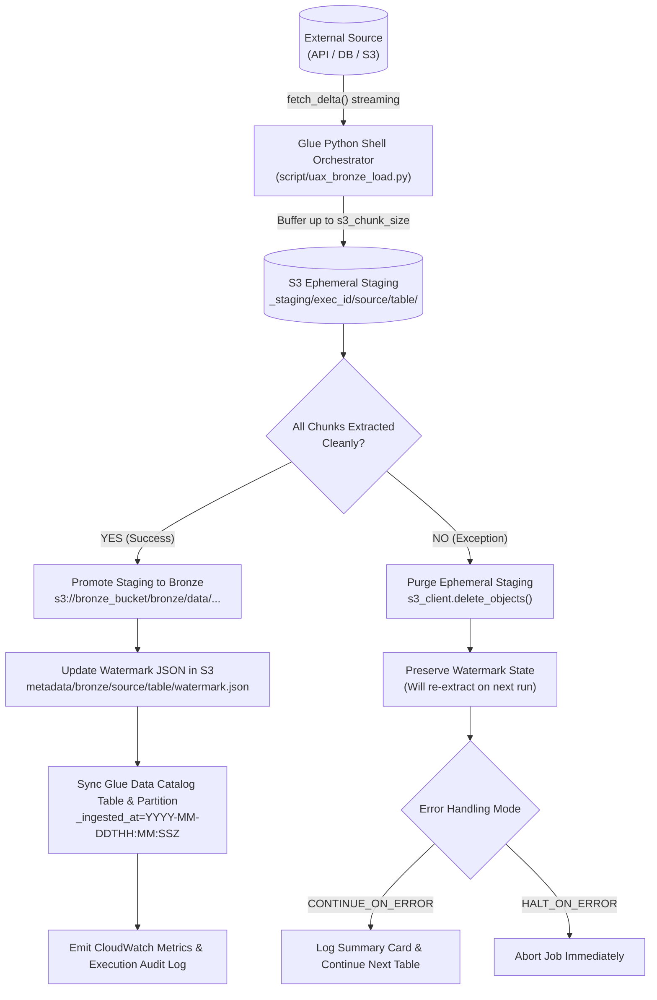
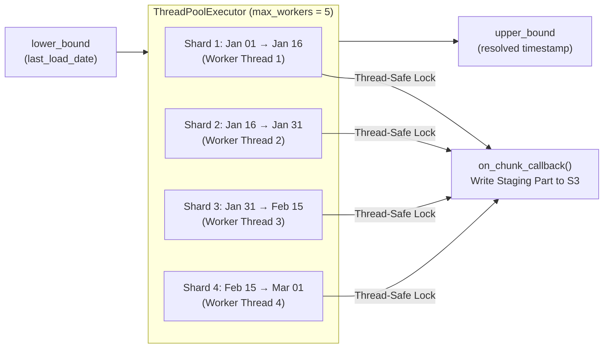
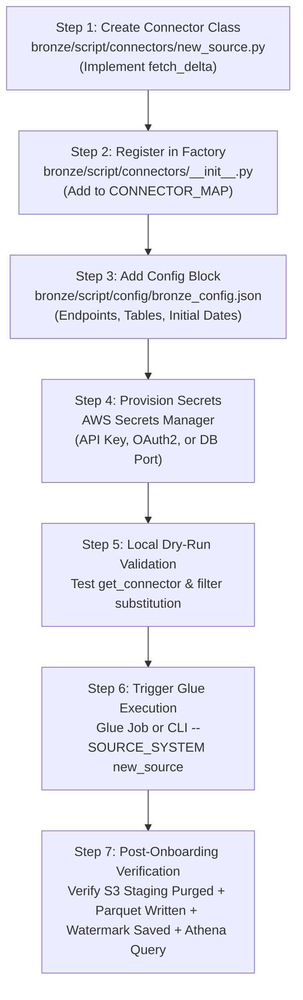

# Bronze Layer — Master Guide

> **Scope**: UAX Data Lake Pipeline · Bronze Ingestion Layer  
> **Stack**: AWS Glue Python Shell · S3 · Secrets Manager · Glue Data Catalog · Athena · CloudWatch

---

## Table of Contents

1. [What Is the Bronze Layer?](#1-what-is-the-bronze-layer)
2. [Directory Layout](#2-directory-layout)
3. [Architecture & Ingestion Flow](#3-architecture--ingestion-flow)
4. [Connectors Reference](#4-connectors-reference)
5. [Parallel Processing & Date Sharding](#5-parallel-processing--date-sharding)
6. [Configurable Upper Bound & Backfill Mode](#6-configurable-upper-bound--backfill-mode)
7. [Configuration Reference](#7-configuration-reference)
8. [Watermark & State Management](#8-watermark--state-management)
9. [Glue Data Catalog Integration](#9-glue-data-catalog-integration)
10. [Running the Job (CLI Options)](#10-running-the-job-cli-options)
11. [Error Handling & Resilience](#11-error-handling--resilience)
12. [Observability & Monitoring](#12-observability--monitoring)
13. [Step-by-Step Guide: Onboarding a New Source System](#13-step-by-step-guide-onboarding-a-new-source-system)

---

## 1. What Is the Bronze Layer?

The Bronze layer is the **first stage** of the UAX Data Lake pipeline. It ingests raw, immutable data from external source systems into S3 in Parquet format, partitioned by ingestion timestamp. It guarantees:

- **Zero data loss** — High-Water Mark (HWM) watermark advances only after successful staging promotion.
- **Zero duplication** — incremental delta extraction strictly bounded by `lower_bound` / `upper_bound`.
- **No orphan files** — two-phase atomic staging promotion; failed runs are cleaned up immediately.
- **Instant queryability** — Glue Data Catalog tables and partitions are registered programmatically via API (no crawler wait required).
- **Pluggable source architecture** — new sources are onboarded solely via connector classes without altering the orchestrator.

---

## 2. Directory Layout

All paths are relative to `bronze/`:

```
bronze/
├── BRONZE_LAYER_GUIDE.md          ← Master reference guide (this file)
├── BRONZE_CODE_LOW_LEVEL.md       ← Function-level mechanics & internal contracts
├── BRONZE_FEATURES.md             ← Catalog of all 42 pipeline features
├── BRONZE_TROUBLESHOOTING.md      ← Comprehensive error catalog with exact fixes
└── script/
    ├── uax_bronze_load.py         ← Glue Shell orchestrator & entry point
    ├── config_loader.py           ← 3-tier config resolution & dynamic filters
    ├── config/
    │   └── bronze_config.json     ← Central pipeline configuration
    └── connectors/
        ├── __init__.py            ← Connector factory (get_connector)
        ├── moveworks.py           ← Moveworks Records API (Parallel + Sequential)
        ├── servicenow.py          ← ServiceNow Table API
        ├── genesys.py             ← Genesys Cloud Analytics API
        ├── database.py            ← Relational DBs (PostgreSQL, MySQL, MariaDB, SQLite)
        ├── s3_file.py             ← S3 Flat Files (CSV, TSV, JSON, NDJSON, Parquet)
        ├── http_client.py         ← Resilient HTTP client (Retries, 429 backoff)
        └── oauth.py               ← OAuth 2.0 token manager with in-memory caching
```

**S3 bucket layout (runtime)**:
```
s3://<bronze_bucket>/
├── bronze/data/<source>/<table_name>/_ingested_at=<YYYY-MM-DDTHH:MM:SSZ>/
│   ├── delta_<execution_id>_part_0001.parquet
│   └── delta_<execution_id>_part_0002.parquet
├── _staging/exec_<execution_id>/<source>/<table_name>/     (ephemeral staging)
│   └── delta_<execution_id>_part_0001.parquet
s3://<state_bucket>/
├── metadata/bronze/<source>/<table_name>/watermark.json   (HWM state)
└── metadata/logs/bronze/<source>/execution_<id>.json      (audit execution log)
```

---

## 3. Architecture & Ingestion Flow



---

## 4. Connectors Reference

| Source | Connection Type | Auth Method | Pagination Style | Sharding Support |
|---|---|---|---|---|
| **Moveworks** | REST API | OAuth 2.0 (`client_credentials`) | `@odata.nextLink` cursor | Yes (Parallel Date Shards) |
| **ServiceNow** | REST API | OAuth 2.0 / Basic Auth | `sysparm_offset` + `sysparm_limit` | Sequential |
| **Genesys** | REST API | OAuth 2.0 (`client_credentials`) | `pageNumber` + `pageSize` | Sequential |
| **Database** | JDBC / DB-API | Username / Password + DB Port | Cursor `fetchmany(size)` | Sequential |
| **S3 File** | S3 Object Store | IAM Role / Cross-account STS | `ListObjectsV2` + `LastModified` | Sequential (`all` or `latest`) |

All connectors adhere strictly to the frozen `fetch_delta()` contract:
```python
def fetch_delta(
    last_load_date: str,
    secret_dict: dict,
    table_name: str,
    source_config: dict,
    custom_query: Optional[str] = None,
    on_chunk_callback: Optional[Callable[[List[Dict[str, Any]], int], None]] = None,
    s3_chunk_size: int = 10000
) -> List[dict]:
```

---

## 5. Parallel Processing & Date Sharding

### Why Moveworks Supports Parallel Sharding
The Moveworks Records API natively supports bounded OData date filters:
```
$filter=last_updated_time ge '2025-01-01T00:00:00Z' and last_updated_time le '2025-01-16T00:00:00Z'
```
This enables the total extraction interval `[lower_bound, upper_bound]` to be segmented into independent, non-overlapping date windows (shards) executed concurrently.



### Configuration
```json
"moveworks": {
  "parallel_processing": {
    "enabled": true,
    "max_workers": 5,
    "shard_window_days": 15
  }
}
```

- Each shard runs in its own thread via `ThreadPoolExecutor(max_workers=N)`.
- A `threading.Lock` protects `on_chunk_callback` writes, ensuring thread-safe S3 staging flushes and strictly sequential part numbers.

---

## 6. Configurable Upper Bound & Backfill Mode

### What Is Upper Bound?
By default, the upper boundary of an incremental extraction is **the current execution time** (`datetime.now(timezone.utc)`).

In many data engineering scenarios (such as historical backfilling, reprocessing specific past periods, or running pipeline tests), you must cap extraction at a specific past timestamp:
```
[lower_bound = 2024-01-01T00:00:00Z]  →  [upper_bound = 2024-03-01T00:00:00Z]
```

### Resolution Precedence
The pipeline resolves `upper_bound` via the standard 3-tier hierarchy:
1. **Tier 1 (CLI)**: `--UPPER_BOUND 2024-03-01T00:00:00Z`
2. **Tier 2 (Config)**: `source_systems.<source>.upper_bound` or `pipeline_defaults.upper_bound` in `bronze_config.json`
3. **Tier 3 (Runtime Fallback)**: `datetime.now(timezone.utc).strftime('%Y-%m-%dT%H:%M:%SZ')`

### Backfill & Watermark Mechanics
When an `upper_bound` is explicitly provided:
- Connectors extract only records within `[lower_bound, upper_bound]`.
- Upon successful staging promotion, **the watermark is advanced to `upper_bound`** (NOT `current_run_time`).
- **Guarantee**: Subsequent pipeline executions automatically resume from `upper_bound` without skipping historical records!

```bash
# Example: Backfill Q1 2024 data without skipping into current time
python3 bronze/script/uax_bronze_load.py \
  --SOURCE_SYSTEM moveworks \
  --SOURCE_TABLE_NAME interactions \
  --INITIAL_LOAD_DATE 2024-01-01T00:00:00Z \
  --UPPER_BOUND 2024-04-01T00:00:00Z
# Watermark saved to S3: 2024-04-01T00:00:00Z
```

---

## 7. Configuration Reference

Central file: `bronze/script/config/bronze_config.json`

### `pipeline_defaults`

| Key | Default | Description |
|---|---|---|
| `bronze_bucket` | `""` | Target S3 bucket for Bronze Parquet data partitions. Set here or pass via CLI. |
| `state_bucket` | `""` | S3 bucket for watermarks and audit logs (defaults to `bronze_bucket` if empty). |
| `upper_bound` | `""` | Optional ISO 8601 UTC timestamp to bound extraction for backfill. Defaults to current time. |
| `batch_size` | `1000` | Default API page size or record batch size. |
| `s3_chunk_size` | `10000` | Number of records buffered before flushing a Parquet file chunk to S3. |
| `bronze_data_prefix` | `bronze/data` | S3 prefix for raw data (e.g. `s3://<bucket>/bronze/data/<source>/<table>/`). |
| `output_format` | `parquet` | Data format: `parquet` or `json`. |
| `parquet_compression` | `snappy` | Parquet compression: `snappy`, `gzip`, `zstd`, `none`. |
| `flatten_nested_json` | `true` | Recursively flattens nested JSON payloads into column hierarchies. |
| `flatten_separator` | `_` | Column name separator for flattened keys (e.g. `user_email`). |
| `error_handling_mode` | `CONTINUE_ON_ERROR` | `CONTINUE_ON_ERROR` (skip bad tables) or `HALT_ON_ERROR` (abort on first error). |
| `cloudwatch_namespace` | `UAX/DataPipeline/Ingestion` | Namespace for custom CloudWatch metrics. |
| `default_initial_load_date` | `""` | Optional global fallback. Prefer setting explicit per-table dates. |
| `glue_catalog.enabled` | `true` | Automatically synchronizes Glue Data Catalog tables and partitions. |
| `glue_catalog.database_name` | `uax_datalake_db_dev` | Target unified Glue Data Catalog database name. |
| `glue_catalog.table_prefix` | `raw_tbl_` | Catalog table name prefix (e.g. `raw_tbl_interactions`). |
| `glue_catalog.sync_watermark_table` | `true` | Maintains Athena-queryable `raw_tbl_watermarks` table. |

### `source_systems.<source>`

| Key | Applies To | Description |
|---|---|---|
| `base_url` | REST APIs | API base URL. Can be overridden by `api_base_url` in Secrets Manager. |
| `api_endpoint_template`| REST APIs | URI template with `{table_name}` placeholder. |
| `default_tables` | All | List of tables processed when `--SOURCE_TABLE_NAME` is not supplied. |
| `response_records_key` | REST APIs | JSON key containing record array (e.g. `value`, `result`, `entities`). |
| `batch_size` | REST APIs | Page size requested from the API (Moveworks max: 500). |
| `upper_bound` | All | Source-specific upper-bound override for backfill. |
| `table_initial_load_dates`| All | **Mandatory** ISO 8601 UTC date per table for first run. |
| `table_query_overrides` | REST/DB | Table-specific query/filter string overriding `default_delta_filter`. |
| `custom_table_endpoints`| REST APIs | Custom URL endpoints for non-standard tables. |
| `default_delta_filter` | REST/DB | Template filter (e.g. `last_updated_time ge '{last_load_date}' and last_updated_time le '{upper_bound}'`). |
| `query_template` | Database | SQL query template with `{table_name}` and `{query_filter}` placeholders. |
| `fetch_size` | Database | Cursor batch size per database `fetchmany` call. |
| `source_bucket` | S3File | S3 bucket containing source files to ingest. |
| `file_prefix` | S3File | Key prefix for file search. |
| `fetch_mode` | S3File | `all` (files modified after watermark) or `latest` (most recent file only). |
| `parallel_processing` | Moveworks | Multi-threaded date-sharding configuration block. |

---

## 8. Watermark & State Management

### Watermark File Path in S3
```
s3://<state_bucket>/metadata/bronze/<source_system>/<table_name>/watermark.json
```

### Watermark Schema
```json
{
  "source_system": "moveworks",
  "table_name": "raw_tbl_interactions",
  "last_load_date": "2024-03-01T00:00:00Z",
  "last_status": "SUCCESS",
  "records_ingested": 45230,
  "updated_at": "2026-09-20T12:00:00Z"
}
```

### Watermark Resolution Logic
1. S3 watermark file exists → `last_load_date` read from S3.
2. S3 watermark does not exist (first execution) → reads `table_initial_load_dates.<table_name>` from `bronze_config.json`.
3. CLI override `--INITIAL_LOAD_DATE` provided → overrides both S3 and config.
4. If no date is found → raises `ValueError` immediately (prevents silent full table re-ingestion).

---

## 9. Glue Data Catalog Integration

- **Database**: Single unified database (e.g. `uax_datalake_db_dev`).
- **Table Name**: `<table_prefix><clean_table_name>` (e.g. `raw_tbl_conversations`).
- **Partition Key**: `_ingested_at` (`string`, formatted as ISO 8601 UTC).
- **Audit Table**: `raw_tbl_watermarks` tracks ingestion state across all tables and sources for easy Athena querying:
```sql
SELECT source_system, table_name, last_load_date, last_status, records_ingested, updated_at
FROM uax_datalake_db_dev.raw_tbl_watermarks
ORDER BY updated_at DESC;
```

---

## 10. Running the Job (CLI Options)

### Standard CLI Arguments
```bash
python3 bronze/script/uax_bronze_load.py \
  --SOURCE_SYSTEM moveworks \
  --SOURCE_TABLE_NAME interactions,conversations \
  --BRONZE_BUCKET my-bronze-bucket \
  --STATE_BUCKET my-state-bucket \
  --SECRET_NAME dev/moveworks/api_credentials \
  --INITIAL_LOAD_DATE 2024-01-01T00:00:00Z \
  --UPPER_BOUND 2024-03-01T00:00:00Z \
  --BATCH_SIZE 500 \
  --S3_CHUNK_SIZE 10000 \
  --ERROR_HANDLING_MODE CONTINUE_ON_ERROR
```

---

## 11. Error Handling & Resilience

- **Atomic Staging**: Data is written to `_staging/exec_<id>/` first. If any error occurs during extraction, `cleanup_failed_staging()` deletes all uncommitted staging files. Bronze partition directories never contain incomplete or corrupt files.
- **Watermark Safety**: The S3 watermark file is updated ONLY AFTER staging promotion succeeds. Failed runs leave the watermark untouched so the next execution automatically retries the extraction window.
- **HTTP Resilience**: `HTTPClient` implements automated retries with exponential backoff and jitter for network glitches and HTTP 429 / 5xx rate limits.
- **Error Modes**:
  - `CONTINUE_ON_ERROR`: Logs table error, purges its staging, records failure in table summary, and continues to the remaining tables.
  - `HALT_ON_ERROR`: Immediately aborts execution upon the first table failure.

---

## 12. Observability & Monitoring

- **CloudWatch Metrics** (Namespace: `UAX/DataPipeline/Ingestion`):
  - `RecordsIngested` (Count)
  - `IngestionDurationSeconds` (Seconds)
  - `TableExtractionSuccess` (Count: 1=Success, 0=Failure)
- **Persistent Execution Logs**: Saved to `s3://<state_bucket>/metadata/logs/bronze/<source>/execution_<id>.json`.

---

## 13. Step-by-Step Guide: Onboarding a New Source System

The Bronze pipeline is architected around the **Open/Closed Principle**: it is open for extension via pluggable connectors, but closed for modification in the orchestrator. **You NEVER modify `bronze/script/uax_bronze_load.py` to onboard a new source!**

Follow this production checklist:



### Step 1: Create the Connector Module
Create a new file in `bronze/script/connectors/<new_source>.py`.

Use this production boilerplate template:

```python
"""
<NewSource> Connector for UAX Bronze Ingestion Layer.
"""

import logging
from typing import Dict, Any, List, Optional, Callable
from connectors.http_client import HTTPClient
from config_loader import ConfigLoader

logger = logging.getLogger(__name__)


class NewSourceConnector:
    """Connector implementation for <NewSource>."""

    @staticmethod
    def fetch_delta(
        last_load_date: str,
        secret_dict: Dict[str, Any],
        table_name: str,
        source_config: Dict[str, Any],
        custom_query: Optional[str] = None,
        on_chunk_callback: Optional[Callable[[List[Dict[str, Any]], int], None]] = None,
        s3_chunk_size: int = 10000,
    ) -> List[Dict[str, Any]]:
        """
        Extracts delta records from <NewSource> updated since last_load_date.
        Streams records to S3 staging via on_chunk_callback in memory-safe chunks.
        """
        if not last_load_date or not str(last_load_date).strip():
            raise ValueError(f"NewSource connector: 'last_load_date' is required for table '{table_name}'.")

        config = source_config or {}
        base_url = secret_dict.get('api_base_url') or config.get('base_url')
        if not base_url:
            raise ValueError(f"NewSource connector: 'base_url' is missing for table '{table_name}'.")

        endpoint = ConfigLoader.get_table_endpoint('new_source', table_name, config)
        query_filter = ConfigLoader.get_table_query_filter(
            'new_source', table_name, last_load_date, custom_query, config,
            upper_bound=config.get('upper_bound')
        )
        response_key = config.get('response_records_key', 'data')
        batch_size = int(config.get('batch_size', 500))

        url = f"{base_url.rstrip('/')}{endpoint}"
        logger.info(f"[NewSource/{table_name}] Starting extraction since {last_load_date} from {url}")

        records_buffer: List[Dict[str, Any]] = []
        all_records: List[Dict[str, Any]] = []
        part_num = 1
        page = 1
        has_more = True

        while has_more:
            params = {
                'filter': query_filter,
                'page': page,
                'limit': batch_size
            }
            response = HTTPClient.get(url=url, secret_dict=secret_dict, params=params)

            if isinstance(response, dict):
                batch = response.get(response_key, [])
            elif isinstance(response, list):
                batch = response
            else:
                batch = []

            if not batch:
                break

            logger.info(f"[NewSource/{table_name}] Page {page}: fetched {len(batch)} records")

            if on_chunk_callback:
                records_buffer.extend(batch)
                if len(records_buffer) >= s3_chunk_size:
                    on_chunk_callback(records_buffer, part_num)
                    records_buffer = []
                    part_num += 1
            else:
                all_records.extend(batch)

            # Determine pagination completion
            if len(batch) < batch_size:
                has_more = False
            else:
                page += 1

        # Flush final remaining records
        if on_chunk_callback and records_buffer:
            on_chunk_callback(records_buffer, part_num)

        logger.info(f"[NewSource/{table_name}] Extraction completed successfully.")
        return all_records if not on_chunk_callback else []
```

### Step 2: Register in Connector Factory
Open `bronze/script/connectors/__init__.py` and add the import and mapping:

```python
from connectors.new_source import NewSourceConnector

CONNECTOR_MAP = {
    'moveworks': MoveworksConnector,
    'servicenow': ServiceNowConnector,
    'genesys': GenesysConnector,
    'database': DatabaseConnector,
    's3_file': S3FileConnector,
    'new_source': NewSourceConnector,   # <-- Add new connector here
}
```

### Step 3: Add Configuration in `bronze_config.json`
Open `bronze/script/config/bronze_config.json` and add a new configuration block under `source_systems`:

```json
"new_source": {
  "_secrets_required": ["auth_type", "api_base_url", "api_key"],
  "base_url": "https://api.newsource.com/v1",
  "api_endpoint_template": "/data/{table_name}",
  "default_delta_filter": "updated_at>='{last_load_date}' and updated_at<='{upper_bound}'",
  "response_records_key": "data",
  "batch_size": 500,
  "default_tables": ["users", "transactions"],
  "table_initial_load_dates": {
    "users": "2024-01-01T00:00:00Z",
    "transactions": "2024-01-01T00:00:00Z"
  },
  "table_query_overrides": {},
  "custom_table_endpoints": {}
}
```

### Step 4: Provision Secrets in AWS Secrets Manager
Create a secret named `prod/new_source/api_credentials` with JSON payload:
```json
{
  "auth_type": "api_key",
  "api_base_url": "https://api.newsource.com/v1",
  "api_key": "your_secure_api_key_here",
  "api_key_header": "X-API-Key"
}
```
*(For OAuth 2.0 sources, provide `auth_type: oauth2`, `client_id`, `client_secret`, and `token_url`)*.

### Step 5: Test Locally / Dry-Run
Run a syntax and import verification:
```bash
python3 -c "
import sys
sys.path.insert(0, 'bronze/script')
from connectors import get_connector
conn = get_connector('new_source')
print('Successfully resolved connector:', conn.__name__)
"
```

### Step 6: Trigger Ingestion via Glue Job or CLI
```bash
python3 bronze/script/uax_bronze_load.py \
  --SOURCE_SYSTEM new_source \
  --SOURCE_TABLE_NAME users \
  --BRONZE_BUCKET my-datalake-dev-bucket \
  --SECRET_NAME prod/new_source/api_credentials
```

### Step 7: Post-Onboarding Verification Checklist
1. **S3 Staging Cleaned Up**: Verify `s3://<bronze_bucket>/_staging/` is empty.
2. **Bronze Partition Populated**: Check `s3://<bronze_bucket>/bronze/data/new_source/users/_ingested_at=<timestamp>/` contains `.parquet` files.
3. **Watermark File Created**: Check `s3://<state_bucket>/metadata/bronze/new_source/users/watermark.json` has `last_status: SUCCESS`.
4. **Athena Query Verification**: Run query in Athena:
   ```sql
   SELECT * FROM uax_datalake_db_dev.raw_tbl_users LIMIT 10;
   ```
