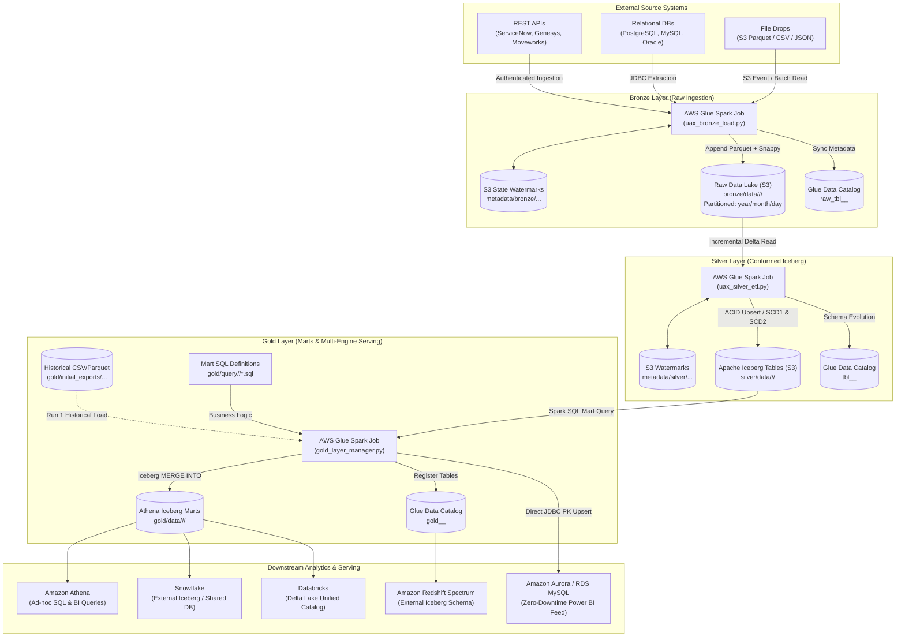
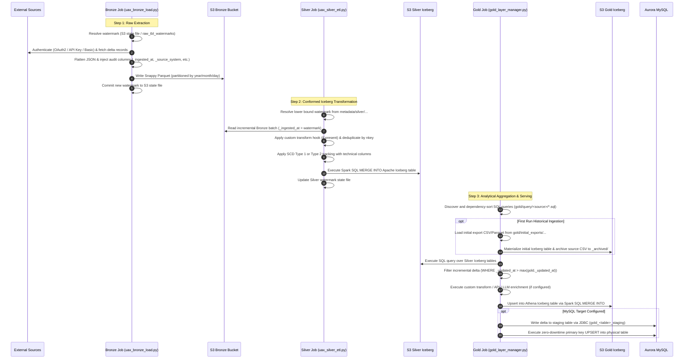
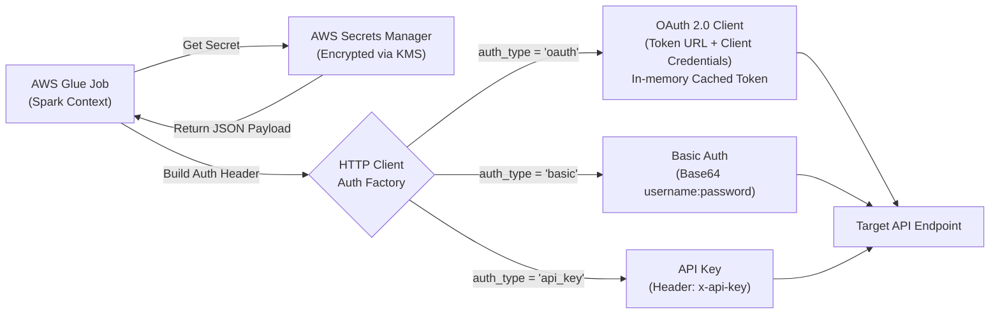

# Enterprise Multi-Hop Lakehouse Pipeline — Architecture & Technical Specifications

This repository hosts a production-grade, enterprise data lakehouse platform designed to process high-throughput batch and streaming-like micro-batch workloads. Built natively on **Apache Spark (AWS Glue)**, **Apache Iceberg**, and **AWS Glue Data Catalog**, the platform enforces strict data governance, idempotent loading, schema evolution, and multi-engine serving.

---

## 1. High-Level Lakehouse Architecture

The architecture follows the **Medallion (Multi-Hop) Architecture** pattern, isolating ingestion, cleansing, and business aggregation into decoupled processing layers:



---

## 2. Layer-by-Layer Responsibilities

| Layer | Storage Engine | Format | Commit Pattern | Primary Purpose |
|---|---|---|---|---|
| **Bronze** | Amazon S3 | Apache Parquet (Snappy) | Append-Only with Hive partitioning (`year=YYYY/month=MM/day=DD`) | Ingest raw payload exactly as received from source systems; preserve lineage with zero data loss. |
| **Silver** | Amazon S3 + Apache Iceberg | Apache Iceberg v2 | ACID Upsert (`MERGE INTO`), SCD Type 1 & Type 2 | Enforce conformed types, natural key deduplication, schema evolution, and row-level updates. |
| **Gold** | Amazon S3 + Apache Iceberg | Apache Iceberg v2 + RDBMS | Idempotent Upsert + Dual-Write Serving | Aggregate dimensional models, materializing physical tables in Athena and syncing to MySQL/Redshift/Snowflake. |

---

## 3. End-to-End Execution Flow



---

## 4. Script Architecture & Linking Rationale

The data pipeline code is intentionally modularized into dedicated execution scripts and config loaders per layer:

### Why Standalone Python Scripts?
1. **AWS Glue Job Isolation**: Each hop runs as an independent AWS Glue Spark job (`uax_bronze_load.py`, `uax_silver_etl.py`, `gold_layer_manager.py`). Failures in Gold serving never block Bronze ingestion.
2. **Dedicated Resource Scaling**:
   - Bronze runs lightweight standard Python/Spark workers (`G.1X` or `Standard`).
   - Silver runs compute-intensive Iceberg compaction and merge workers (`G.2X`).
   - Gold runs memory-intensive multi-target broadcast and JDBC serving workers.
3. **Decoupled Configuration**:
   - `config_loader.py` (Bronze), `silver_config_loader.py` (Silver), and `gold_config_loader.py` (Gold) allow complete schema and parameter adjustments without changing execution code.
4. **Custom Transform Hooks**:
   - Complex business rules (e.g. LLM transcript summarization, entity resolution) live in `custom_transforms/` modules, loaded dynamically at runtime via Python introspection without altering the core pipeline engines.

---

## 5. Security & Authentication Architecture

All credentials, access tokens, and API keys are strictly forbidden from source code and JSON configuration files.



### Authentication Strategies:
1. **OAuth 2.0 (`client_credentials`)**: Used for modern SaaS integrations (Genesys Cloud, Moveworks, Workday). The pipeline requests an access token from the Identity Provider token endpoint, caches it in-memory, and automatically refreshes it 60 seconds before expiration.
2. **Basic Authentication**: Used for legacy enterprise platforms (e.g. ServiceNow service accounts) utilizing base64-encoded credentials over TLS 1.3.
3. **API Key**: Direct header injection (e.g. `x-api-key`, `Authorization: Bearer <key>`) for cloud microservices.
4. **RDS / JDBC Authentication**: Injects database host, port, username, and password dynamically into Spark JDBC connection strings with SSL enforced (`useSSL=true&requireSSL=true`).

---

## 6. Directory Structure & Documentation Navigation

```text
Data-pipeline/
├── docs/                                  # Centralized Enterprise Documentation
│   ├── ARCHITECTURE.md                    # Platform architecture (this document)
│   ├── ONBOARDING_GUIDE.md                # Step-by-step developer onboarding & runbook
│   ├── bronze/
│   │   ├── BRONZE_LAYER.md                # Bronze engine architecture & low-level internals
│   │   └── CONFIG_BLUEPRINT.md            # bronze_config.json blueprint & parameters
│   ├── silver/
│   │   ├── SILVER_LAYER.md                # Silver Iceberg engine architecture & SCD rules
│   │   └── CONFIG_BLUEPRINT.md            # silver_config.json blueprint & parameters
│   └── gold/
│       ├── GOLD_LAYER.md                  # Gold multi-engine serving & mart lifecycle
│       └── CONFIG_BLUEPRINT.md            # gold_config.json blueprint & parameters
├── bronze/                                # Bronze Layer Implementation
│   ├── script/
│   │   ├── uax_bronze_load.py             # Main Bronze PySpark engine
│   │   ├── config_loader.py               # Hierarchical config parser
│   │   ├── config/bronze_config.json      # Bronze ingestion config
│   │   └── connectors/                    # Ingestion connectors (REST, S3, JDBC)
├── silver/                                # Silver Layer Implementation
│   ├── script/
│   │   ├── uax_silver_etl.py              # Main Silver Iceberg PySpark engine
│   │   ├── silver_config_loader.py        # Silver config parser
│   │   ├── transformer.py                 # Core transformation utilities
│   │   ├── custom_transforms/             # Table-specific transformation hooks
│   │   └── config/silver_config.json      # Silver transformation config
├── gold/                                  # Gold Layer Implementation
│   ├── script/
│   │   ├── gold_layer_manager.py          # Main Gold multi-target serving engine
│   │   ├── gold_config_loader.py          # Gold config parser
│   │   ├── gold_initial_load.py           # Historical backfill & CSV reconciliation engine
│   │   ├── custom_transforms/             # Table-specific transformation & API hooks
│   │   └── config/gold_config.json        # Gold serving config
│   └── query/                             # Mart Spark SQL query definitions
│       ├── genesys/                       # Genesys dimensional views
│       └── moveworks/                     # Moveworks dimensional views
└── README.md                              # Root repository overview
```
