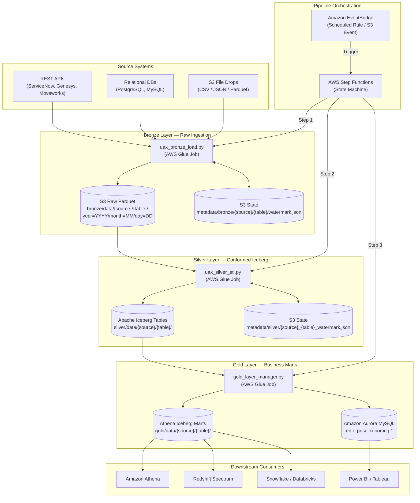
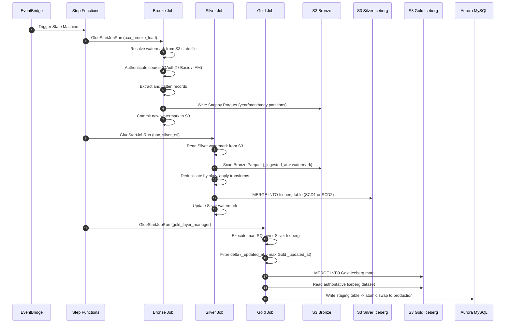

# UAX DataLake — End-to-End Architecture

> **Project:** UAX DataLake  
> **Pattern:** Medallion (Multi-Hop) Architecture — Bronze → Silver → Gold  
> **Orchestration:** Amazon EventBridge → AWS Step Functions → AWS Glue Spark Jobs

---

## 1. High-Level Overview

UAX DataLake ingests operational data from multiple enterprise source systems, refines it through three isolated processing layers, and serves business-ready data marts to downstream analytics and BI tools.

Each layer runs as an independent AWS Glue PySpark job. Step Functions coordinates the sequential execution order. EventBridge triggers the entire pipeline on a schedule or on an S3 arrival event.



---

## 2. Orchestration: EventBridge → Step Functions

### 2.1 Trigger

An **Amazon EventBridge rule** fires on a cron schedule (e.g., `cron(0 6 * * ? *)` for daily at 06:00 UTC) or on an S3 event (new file dropped in a vendor bucket). EventBridge invokes the Step Functions state machine as its target.

### 2.2 Step Functions State Machine

The state machine runs the three Glue jobs **sequentially** using `GlueStartJobRun` and `GlueStartJobRunSync` task states. Each step waits for job completion before the next one starts.

```
EventBridge Trigger
        │
        ▼
[State: Run Bronze Job]    ──► GlueStartJobRunSync(uax_bronze_load)
        │ SUCCESS
        ▼
[State: Run Silver Job]    ──► GlueStartJobRunSync(uax_silver_etl)
        │ SUCCESS
        ▼
[State: Run Gold Job]      ──► GlueStartJobRunSync(gold_layer_manager)
        │ SUCCESS
        ▼
[State: Pipeline Complete] ──► SNS Notification (optional)
        │ ANY FAILURE
        ▼
[State: Error Handler]     ──► SNS Alert + CloudWatch Alarm
```

### 2.3 Why Sequential, Not Parallel?

| Concern | Reasoning |
|---|---|
| **Data dependency** | Silver reads Bronze output. Gold reads Silver Iceberg. The order enforces availability. |
| **Watermark integrity** | Each layer commits its watermark only after a successful write. Parallel execution would break state boundaries. |
| **Failure isolation** | Step Functions retries the failed Glue job independently before failing the pipeline. |

---

## 3. Layer Summary

| Layer | Job Script | Input | Output | Storage |
|---|---|---|---|---|
| **Bronze** | `uax_bronze_load.py` | APIs / DBs / S3 Files | Append-only Parquet partitioned by date | S3 `bronze/data/` |
| **Silver** | `uax_silver_etl.py` | Bronze Parquet (incremental) | Apache Iceberg v2 (ACID upsert / SCD) | S3 `silver/data/` + Glue Catalog |
| **Gold** | `gold_layer_manager.py` | Silver Iceberg (incremental delta) | Athena Iceberg Mart + Aurora MySQL sync | S3 `gold/data/` + Aurora |

---

## 4. End-to-End Sequence



---

## 5. Layer Responsibilities

### Bronze — Raw Ingestion
- Connects to upstream sources via pluggable connectors (REST, JDBC, S3 file).
- Extracts records incrementally using per-table S3 watermark state files.
- Flattens nested JSON, injects audit columns (`_ingested_at`, `_source_system`, etc.), writes Snappy Parquet partitioned by `year/month/day`.
- Commits the new watermark only after data is confirmed written.

### Silver — Conformed Iceberg
- Reads only new Bronze records (`_ingested_at > last_watermark`).
- Deduplicates within each micro-batch using natural keys and ordering columns.
- Applies SCD Type 1 (in-place upsert) or SCD Type 2 (historical version tracking).
- Automatically evolves the Iceberg schema when new columns arrive from Bronze.

### Gold — Business Marts
- Executes modular SQL queries (`gold/query/<source>/<table>.sql`) over Silver Iceberg.
- For incremental tables, only processes records changed since the last Gold run (`_updated_at > max(gold._updated_at)`).
- For full-refresh tables, re-materializes the entire mart from all Silver records.
- Materializes results into Athena Iceberg as the **single source of truth**.
- Syncs to Aurora MySQL using an atomic staging-swap for zero-downtime BI serving.

---

## 6. Security Architecture

All credentials are stored in **AWS Secrets Manager**. No secrets appear in config files or code.

| Auth Type | Used For | Mechanics |
|---|---|---|
| `oauth` (client_credentials) | Genesys Cloud, Moveworks | Cached Bearer token, auto-refreshed 60s before expiry |
| `basic` | ServiceNow (legacy instances) | Base64 header injected per request |
| `api_key` | Internal microservices | Static header injection |
| `iam_role` | Cross-account S3 reads | Managed by boto3 / Glue execution IAM role |

---

## 7. Repository Structure

```
Data-pipeline/
├── docs/
│   ├── ARCHITECTURE.md            # This document
│   ├── ONBOARDING_GUIDE.md        # Developer runbook
│   ├── bronze/
│   │   ├── BRONZE_LAYER.md        # Bronze engine internals
│   │   ├── CONFIG_BLUEPRINT.md    # bronze_config.json parameter reference
│   │   └── ENHANCEMENT_GUIDE.md   # How the Bronze code is structured for contributors
│   ├── silver/
│   │   ├── SILVER_LAYER.md        # Silver engine internals
│   │   ├── CONFIG_BLUEPRINT.md    # silver_config.json parameter reference
│   │   └── ENHANCEMENT_GUIDE.md   # How the Silver code is structured for contributors
│   └── gold/
│       ├── GOLD_LAYER.md          # Gold engine internals
│       ├── CONFIG_BLUEPRINT.md    # gold_config.json parameter reference
│       └── ENHANCEMENT_GUIDE.md   # How the Gold code is structured for contributors
├── bronze/script/
│   ├── uax_bronze_load.py
│   ├── config_loader.py
│   ├── config/bronze_config.json
│   └── connectors/
├── silver/script/
│   ├── uax_silver_etl.py
│   ├── silver_config_loader.py
│   ├── transformer.py
│   ├── custom_transforms/
│   └── config/silver_config.json
├── gold/script/
│   ├── gold_layer_manager.py
│   ├── gold_config_loader.py
│   ├── gold_initial_load.py
│   ├── custom_transforms/
│   └── config/gold_config.json
└── gold/query/
    ├── genesys/
    └── moveworks/
```
