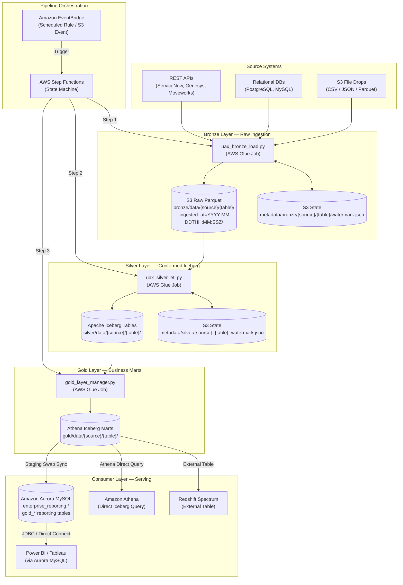
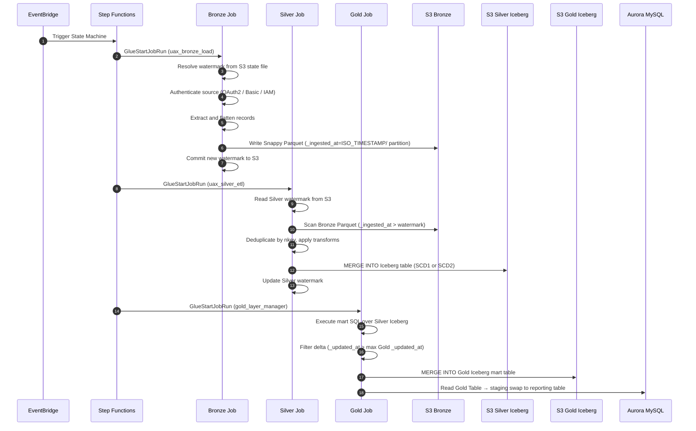

# UAX DataLake — End-to-End Architecture

> **Project:** UAX DataLake  
> **Pattern:** Medallion (Multi-Hop) Architecture — Bronze → Silver → Gold → Consumer  
> **Orchestration:** Amazon EventBridge → AWS Step Functions → AWS Glue Spark Jobs

---

## 1. High-Level Overview

UAX DataLake ingests operational data from multiple enterprise source systems, refines it through three isolated processing layers, and serves business-ready data marts to downstream analytics and BI tools.

Each layer runs as an independent AWS Glue PySpark job. Step Functions coordinates the sequential execution order. EventBridge triggers the entire pipeline on a schedule or on an S3 arrival event.



---

## 2. Orchestration: EventBridge → Step Functions

### 2.1 Trigger

An **Amazon EventBridge rule** fires on a cron schedule (e.g., `cron(0 6 * * ? *)` for daily at 06:00 UTC) or on an S3 event (new file dropped in a vendor bucket). EventBridge invokes the Step Functions state machine as its target.

### 2.2 Step Functions State Machine

The state machine runs the three Glue jobs **sequentially** using `GlueStartJobRun` and `GlueStartJobRunSync` task states. Each step waits for job completion before the next one starts.

```
EventBridge Trigger
        │
        ▼
[State: Run Bronze Job]    ──► GlueStartJobRunSync(uax_bronze_load)
        │ SUCCESS
        ▼
[State: Run Silver Job]    ──► GlueStartJobRunSync(uax_silver_etl)
        │ SUCCESS
        ▼
[State: Run Gold Job]      ──► GlueStartJobRunSync(gold_layer_manager)
        │ SUCCESS
        ▼
[State: Pipeline Complete] ──► SNS Notification (optional)
        │ ANY FAILURE
        ▼
[State: Error Handler]     ──► SNS Alert + CloudWatch Alarm
```

### 2.3 Why Sequential, Not Parallel?

| Concern | Reasoning |
|---|---|
| **Data dependency** | Silver reads Bronze output. Gold reads Silver Iceberg. The order enforces availability. |
| **Watermark integrity** | Each layer commits its watermark only after a successful write. Parallel execution would break state boundaries. |
| **Failure isolation** | Step Functions retries the failed Glue job independently before failing the pipeline. |

---

## 3. Layer Summary

| Layer | Job Script | Input | Output | Storage |
|---|---|---|---|---|
| **Bronze** | `uax_bronze_load.py` | APIs / DBs / S3 Files | Append-only Parquet — single `_ingested_at` ISO timestamp partition per run | S3 `bronze/data/` |
| **Silver** | `uax_silver_etl.py` | Bronze Parquet (incremental) | Apache Iceberg v2 (ACID upsert / SCD) | S3 `silver/data/` + Glue Catalog |
| **Gold** | `gold_layer_manager.py` | Silver Iceberg (incremental delta) | Athena Iceberg Mart (source of truth) | S3 `gold/data/` |
| **Consumer** | _(Gold job — last phase)_ | Gold Iceberg Mart | Aurora MySQL reporting tables + Athena + Redshift | Aurora `enterprise_reporting.*` |

---

## 4. End-to-End Sequence



---

## 5. Layer Responsibilities & Low-Level Code Details

### 5.1 Bronze — Raw Ingestion (`uax_bronze_load.py`)

The Bronze layer runs as an **AWS Glue Python Shell job** — not PySpark. It uses `boto3` and `pandas` entirely in-process, keeping the runtime lightweight and eliminating Spark startup overhead for API and file-based workloads. Every design decision in this layer serves a single principle: **no data loss, no duplicate writes, no partial states.**

#### 5.1.1 Parameter Resolution — 3-Tier Precedence & Glue Arguments

Before extraction begins, `parse_arguments()` resolves every operating parameter through a strict three-tier chain:

```
1. AWS Glue Job Arguments (--KEY value)         ← highest priority (overrides config)
2. JSON Configuration File (loaded from S3)     ← second priority (default pipeline blueprint)
3. Code Hardcoded Defaults                     ← lowest priority (safe baseline fallbacks)
```

The config file is fetched once from S3 via `ConfigLoader.load_config()`, with all `{env}` placeholders substituted at load time. Bucket names, data prefixes, table lists, and catalog settings are all resolved from this merged context before any connector is initialised.

##### Glue Arguments Contract Across Layers:

| Layer | Mandatory Glue Arguments | Optional Glue Arguments (Fallback to Config) |
|---|---|---|
| **Bronze** (`uax_bronze_load.py`) | `--JOB_NAME`<br>`--SOURCE_SYSTEM` | `--ENV` (default: `dev`), `--CONFIG_S3_PATH`, `--SOURCE_TABLE_NAME` (all tables under source if omitted), `--BRONZE_BUCKET`, `--STATE_BUCKET`, `--SECRET_NAME`, `--BATCH_SIZE`, `--INITIAL_LOAD_DATE`, `--UPPER_BOUND`, `--FLATTEN_NESTED_JSON`, `--ERROR_HANDLING_MODE` |
| **Silver** (`uax_silver_etl.py`) | `--JOB_NAME`<br>`--SOURCE_SYSTEM` | `--ENV` (default: `dev`), `--CONFIG_S3_PATH`, `--SOURCE_TABLE_NAME` (all tables under source if omitted), `--PROCESS_LAYER` (`silver`, `gold`, or `both`), `--DATA_LAKE_BUCKET`, `--GLUE_DATABASE`, `--TABLE_PREFIX`, `--BRONZE_DATA_PREFIX`, `--SILVER_DATA_PREFIX`, `--FULL_REFRESH`, `--INCREMENTAL` |
| **Gold** (`gold_layer_manager.py`) | `--JOB_NAME`<br>`--SOURCE_SYSTEM` | `--ENV` (default: `dev`), `--GOLD_CONFIG_S3_PATH`, `--TABLE_NAME`, `--GOLD_SCHEMA` (or `aurora.schema` in config — **mandatory for RDS/Aurora**), `--RDS_SECRET_NAME`, `--DATA_LAKE_BUCKET`, `--GLUE_DATABASE`, `--GOLD_TARGETS`, `--FULL_REFRESH`, `--INCREMENTAL` |

#### 5.1.2 Watermark State — Incremental Load Guard

Each source table maintains its own JSON state file in S3:

```
s3://<state-bucket>/metadata/bronze/<source>/<table>/watermark.json
```

The state file records the last successfully written `_ingested_at` timestamp. The job reads it before extraction and passes it as the lower bound to the connector's query or API filter.

```json
{
  "last_load_date": "2024-06-01T06:00:00Z",
  "source_system": "moveworks",
  "table_name": "conversations",
  "records_ingested": 4823,
  "updated_at": "2024-06-01T06:12:44Z"
}
```

If the state file is absent, the job falls back to `table_initial_load_dates` in `bronze_config.json`. If that too is absent, the job raises a `ValueError` and halts — there is no silent fallback to an arbitrary past date.

#### 5.1.3 S3 Partitioning — One Directory per Execution Run

All records produced by a single job execution land in one S3 directory, keyed by the job's start timestamp:

```
s3://<bronze-bucket>/bronze/data/<source>/<table>/
    _ingested_at=2024-06-01T06:00:00Z/
        delta_20240601_060000_part_0001.parquet
        delta_20240601_060000_part_0002.parquet
```

This is intentional. One execution maps to exactly one partition folder keyed by the run-level ISO 8601 timestamp. Silver can then filter Bronze using `_ingested_at > last_watermark`, picking up only newly arrived execution folders without rescanning any historical data. The ingestion cadence is job-run-based, aligning partition discovery directly with pipeline watermark boundaries.

The timestamp is captured once at job startup and held constant for all tables in that run:

```python
execution_start_utc = datetime.now(timezone.utc)
current_run_time    = execution_start_utc.strftime('%Y-%m-%dT%H:%M:%SZ')
partition_prefix    = f"_ingested_at={current_run_time}"
final_partition_prefix = f"{bronze_data_prefix}/{source}/{table}/{partition_prefix}/"
```

`_ingested_at` is the S3 directory name — the partition key. It is excluded from the Parquet file payload because Hive-compatible engines inject it automatically from the folder name at query time:

```python
# In serialize_chunk_to_bytes()
meta_cols = [c for c in df.columns if c.startswith('_') and c != '_ingested_at']
df = df[data_cols + ordered_meta]   # _ingested_at is omitted from every Parquet file
```

#### 5.1.4 Memory-Safe Streaming — Two-Phase Staging Pattern

The job never holds all records in memory simultaneously. The connector's `fetch_delta()` yields chunks and invokes `chunk_writer_callback()` immediately for each batch:

```python
def chunk_writer_callback(records_chunk: list, part_num: int):
    # Phase 1: Flatten and enrich
    processed = []
    for record in records_chunk:
        rows = flatten_and_expand_record(record, sep='_') \
               if source_config.get('flatten_nested_json', True) else [record]
        for rec in rows:
            rec['_source_system'] = source_system
            rec['_table_name']    = clean_table_name
            rec['_execution_id']  = execution_id
            processed.append(rec)

    # Phase 2: Serialize — data columns first, audit columns last, _ingested_at excluded
    file_bytes, _, ext = serialize_chunk_to_bytes(processed, output_format, parquet_compression)

    # Phase 3: Write to isolated staging area — NOT the final partition yet
    staging_key = f"_staging/exec_{execution_id}/{source}/{table}/part_{part_num:04d}{ext}"
    s3_client.put_object(Bucket=bronze_bucket, Key=staging_key, Body=file_bytes)
```

Writing to `_staging/` first ensures a mid-extraction crash leaves nothing in the production partition. Only after all chunks complete does the job promote them atomically via S3 copy-then-delete:

```python
# promote_staging_to_bronze()
for staging_key in staged_files:
    target_key = f"{final_partition_prefix}{os.path.basename(staging_key)}"
    s3_client.copy_object(
        Bucket=bucket,
        CopySource={'Bucket': bucket, 'Key': staging_key},
        Key=target_key
    )
# Delete staging objects after all copies succeed
s3_client.delete_objects(Bucket=bucket, Delete={'Objects': [{'Key': k} for k in staged_files]})
```

If extraction yields zero records, `cleanup_failed_staging()` removes the empty staging prefix and the watermark is still advanced to `current_run_time` — so the next run starts from now, not from the beginning of time.

#### 5.1.5 JSON Flattening — Recursive Expansion

API payloads often return deeply nested JSON. The `flatten_and_expand_record()` function handles three structural patterns:

| Source shape | Transformation applied |
|---|---|
| Nested dict `{"a": {"b": 1}}` | Flat column `a_b = 1` |
| Primitive array `{"tags": ["x", "y"]}` | Comma-joined string `tags = "x, y"` |
| Object array `{"contacts": [{...}, {...}]}` | Row explosion — one output row per array item, base fields copied to each |

The separator character and enable/disable flag are both configurable per source in `bronze_config.json`.

#### 5.1.6 Glue Data Catalog Sync — Direct API Registration

After staging promotion, `sync_bronze_catalog_table()` registers the table and the new partition directly in the AWS Glue Data Catalog using API calls. No crawler is involved in this step:

```python
# 1. Ensure the Glue database exists (idempotent)
ensure_glue_database(database_name)

# 2. Create or update the catalog table definition
#    _ingested_at goes into PartitionKeys[] only — never into StorageDescriptor.Columns[]
glue_client.create_table(
    DatabaseName=database_name,
    TableInput={
        'Name': f"{table_prefix}{table_name}",          # e.g. raw_tbl_incident
        'PartitionKeys': [{'Name': '_ingested_at', 'Type': 'string'}],
        'StorageDescriptor': {
            'Columns': inferred_columns,                # data cols + audit cols, no _ingested_at
            'Location': f"s3://{bucket}/bronze/data/{source}/{table}/",
            'InputFormat': 'org.apache.hadoop.hive.ql.io.parquet.MapredParquetInputFormat',
            'SerdeInfo': {
                'SerializationLibrary':
                    'org.apache.hadoop.hive.ql.io.parquet.serde.ParquetHiveSerDe'
            }
        }
    }
)

# 3. Register the new partition for this execution run
glue_client.create_partition(
    DatabaseName=database_name,
    TableName=f"{table_prefix}{table_name}",
    PartitionInput={
        'Values': [current_run_time],
        'StorageDescriptor': {
            'Location': f"s3://{bucket}/bronze/data/{source}/{table}/_ingested_at={current_run_time}/"
        }
    }
)
```

Athena can query the table immediately after this step — no crawler run is needed to make the data available.

#### 5.1.7 Glue Crawler — Purpose, Scope, and When to Use It

After the Catalog API registration, the Bronze job can optionally trigger an AWS Glue Crawler. This is controlled by `pipeline_defaults.glue_catalog.trigger_crawler` in `bronze_config.json`.

**The crawler is not required for Athena queryability.** The table and partition are already registered by the direct API call above. The crawler's role is supplementary:

| Question | Answer |
|---|---|
| **Is it required for Athena to query the data?** | No. The table and partition are already in the Catalog via direct API. |
| **What does it do?** | Crawls the S3 prefix, re-infers column types from the actual Parquet files, and updates the Catalog table definition. |
| **When should it be enabled?** | When a source API starts returning new fields that the code-side schema inference missed, or during initial pipeline setup before a stable sample record is available. |
| **What if it is already running?** | `CrawlerRunningException` is caught and logged as INFO. The pipeline does not fail — the Catalog is already correct from the API registration step. |
| **What if it has not been provisioned?** | `EntityNotFoundException` is caught and ignored silently. The job continues normally. |

```python
def trigger_glue_crawler(crawler_name: str) -> None:
    if not crawler_name or not crawler_name.strip():
        return
    try:
        glue_client.start_crawler(Name=crawler_name.strip())
        logger.info(f"Triggered Glue Crawler '{crawler_name}'.")
    except ClientError as ce:
        code = ce.response['Error']['Code']
        if code == 'CrawlerRunningException':
            logger.info("Crawler already RUNNING. Catalog will reflect latest data.")
        elif code in ('EntityNotFoundException', 'NoSuchEntityException'):
            logger.info("Crawler not provisioned. Catalog synced via direct API — no action needed.")
        else:
            logger.warning(f"Could not trigger crawler '{crawler_name}': {ce}")
```

For Silver Iceberg tables, the crawler default is `False`. Spark's Iceberg integration updates the Glue Catalog natively during each write — no external crawler is needed at the Silver layer.

#### 5.1.8 Watermark Commit — Final Step, Atomicity Guarantee

The watermark is written to S3 **after** staging promotion and Catalog registration succeed. This ordering is the atomicity guarantee: if the job crashes after writing data but before advancing the watermark, the next run re-processes the same window and overwrites the same `_ingested_at` folder — no data is skipped, no data is lost.

```python
# Guard: historical backfill jobs may use upper_bound = '9999-01-01'.
# Writing a sentinel value into the watermark would freeze future incremental loads.
# Always commit current_run_time unless upper_bound is a real business timestamp.
is_sentinel = str(table_upper_bound or '').startswith(('9999', '9998'))
effective_watermark = current_run_time if (not table_upper_bound or is_sentinel) \
                      else str(table_upper_bound).strip()
update_last_load_date(state_bucket, state_key, ..., effective_watermark)
```

#### 5.1.9 Audit Columns & Schema Contract

| Column | In Parquet file | In Glue Catalog | Description |
|---|---|---|---|
| `_source_system` | ✅ | ✅ | Source connector name (e.g. `moveworks`) |
| `_table_name` | ✅ | ✅ | Sanitised table name (hyphens → underscores) |
| `_execution_id` | ✅ | ✅ | `YYYYMMDD_HHMMSS` run identifier |
| `_ingested_at` | ❌ (partition directory name only) | ✅ (partition key) | ISO 8601 execution timestamp |

---

### 5.2 Silver — Conformed Iceberg (`uax_silver_etl.py`)

The Silver layer is an **AWS Glue PySpark job**. It reads new Bronze Parquet files incrementally, deduplicates them, applies a declarative transformation pipeline, and merges the results into Apache Iceberg tables registered in the AWS Glue Data Catalog. Iceberg provides ACID transactions, partition evolution, schema evolution, and time-travel — capabilities that plain Parquet cannot offer at scale.

#### 5.2.1 Watermark — Incremental Bronze Read

Silver tracks its own watermark in a separate S3 state file, independent of Bronze:

```
s3://<bucket>/metadata/silver/<source>/<table>/watermark.json
```

On each run, it reads only the Bronze partitions that were written after its last processed timestamp:

```python
# Watermark column is configurable per table; defaults to '_ingested_at'
watermark_column = watermark_cfg.get('watermark_column', '_ingested_at')
last_watermark   = get_silver_last_load_date(s3_client, bucket, state_key, table)

# Partition pushdown — Spark only opens _ingested_at folders newer than last_watermark
bronze_df = spark.read.parquet(
    f"s3://{data_lake_bucket}/bronze/data/{source}/{table}/"
).filter(col(watermark_column) > last_watermark)
```

If no watermark file exists (first run for this table), `last_watermark` returns `None` and the `.filter()` is skipped, resulting in a full initial load. Passing `--FULL_REFRESH=true` on the CLI also bypasses the watermark for ad-hoc reprocessing without deleting the state file.

#### 5.2.2 Deduplication — Window Function within Batch

A single entity can appear multiple times in one Bronze batch if the source emitted it across multiple API pages within the same extraction window. Silver deduplicates before merging into Iceberg:

```python
# dedup_keys: list of natural key column names from silver_config.json per table
# order_by_col: tie-breaker (e.g. 'updated_at', 'sys_updated_on')
window = Window.partitionBy(*dedup_keys).orderBy(col(order_by_col).desc())
deduped_df = bronze_df \
    .withColumn("_rn", row_number().over(window)) \
    .filter(col("_rn") == 1) \
    .drop("_rn")
```

#### 5.2.3 SilverTransformer — Declarative and Custom Transforms

`SilverTransformer.apply()` runs a multi-stage transformation pipeline driven by `silver_config.json`:

```python
transformer    = SilverTransformer(table_config)
transformed_df = transformer.apply(deduped_df)
```

Supported transform types, in execution order:

| Transform type | Config key | Example |
|---|---|---|
| Type coercions | `casts` | `{"col": "created_at", "type": "timestamp"}` |
| Column renames | `renames` | `{"from": "number", "to": "incident_number"}` |
| Row filters | `filters` | `{"condition": "state != 'deleted'"}` |
| Derived columns | `derived_columns` | `{"name": "full_name", "expr": "concat(first, ' ', last)"}` |
| Per-table script | `custom_transform_script` | Python file loaded via `importlib` |

The custom script hook loads a per-table Python module at runtime without modifying the core job:

```python
spec   = importlib.util.spec_from_file_location("custom", transform_path)
module = importlib.util.module_from_spec(spec)
spec.loader.exec_module(module)
df     = module.transform(df, spark, table_config)
```

#### 5.2.4 Merge Strategies — SCD1, SCD2, Append, Overwrite

The strategy is set per table in `silver_config.json` under `merge_strategy`.

**SCD Type 1 — In-place upsert (no history):**

```python
transformed_df.createOrReplaceTempView("incoming")
spark.sql(f"""
    MERGE INTO glue_catalog.{glue_db}.{iceberg_table} AS target
    USING incoming AS source
    ON {" AND ".join([f"target.{k} = source.{k}" for k in dedup_keys])}
    WHEN MATCHED THEN UPDATE SET *
    WHEN NOT MATCHED THEN INSERT *
""")
```

**SCD Type 2 — Full history with version rows:**

```python
# Step 1: Expire the currently active row for each matching natural key
spark.sql(f"""
    MERGE INTO glue_catalog.{glue_db}.{iceberg_table} AS target
    USING incoming AS source
    ON {merge_condition} AND target._is_current = 'Y'
    WHEN MATCHED THEN UPDATE SET
        _valid_to   = current_timestamp(),
        _is_current = 'N'
""")

# Step 2: Append incoming rows as new current versions
new_rows = transformed_df \
    .withColumn("_valid_from", current_timestamp()) \
    .withColumn("_valid_to",   lit("9999-12-31T00:00:00Z")) \
    .withColumn("_is_current", lit("Y")) \
    .withColumn("_is_deleted", coalesce(col("_is_deleted"), lit("N")))
new_rows.write.format("iceberg").mode("append").save(iceberg_path)
```

**Append** — for event/log tables where history must never be modified:

```python
transformed_df.write.format("iceberg").mode("append").save(iceberg_path)
```

**Overwrite** — full replacement for small, low-cardinality dimension tables:

```python
transformed_df.write.format("iceberg") \
    .mode("overwrite") \
    .option("overwrite-mode", "dynamic") \
    .save(iceberg_path)
```

#### 5.2.5 Iceberg Table Auto-Bootstrap

When a table runs for the first time and the target Iceberg table does not exist, Silver creates it using the incoming DataFrame schema:

```python
transformed_df.writeTo(f"glue_catalog.{glue_db}.{iceberg_table}") \
    .tableProperty("format-version", "2") \
    .tableProperty("write.parquet.compression-codec", "snappy") \
    .createOrReplace()
```

#### 5.2.6 Schema Evolution

When Bronze produces a new column that the Iceberg table does not yet have, Iceberg's schema merge capability handles it transparently. The Spark session is configured at startup to accept incoming schema additions:

```python
spark.conf.set(
    "spark.sql.extensions",
    "org.apache.iceberg.spark.extensions.IcebergSparkSessionExtensions"
)
spark.conf.set(
    "spark.sql.catalog.glue_catalog.catalog-impl",
    "org.apache.iceberg.aws.glue.GlueCatalog"
)
# Tables are created with write.spark.accept-any-schema = true,
# allowing MERGE INTO to add new columns automatically during write
```

#### 5.2.7 Watermark Commit

```python
# Written to S3 only after the Iceberg MERGE succeeds
update_silver_watermark(
    s3_client=s3_client,
    bucket=bucket,
    state_key=state_key,
    source_system=source_system,
    table_name=table_name,
    new_watermark=current_run_time,
    total_records=records_merged,
    current_run_time=current_run_time
)
```

#### 5.2.8 Silver Audit Columns

| Column | SCD1 | SCD2 | Description |
|---|---|---|---|
| `_nkey` | ✅ | ✅ | SHA-256 hash of natural key columns — enables fast equi-joins |
| `_updated_at` | ✅ | ✅ | Timestamp of the last successful merge for this row |
| `_valid_from` | — | ✅ | When this version of the row became active |
| `_valid_to` | — | ✅ | When this version expired (`9999-12-31` = currently active) |
| `_is_current` | — | ✅ | `'Y'` for the latest version of each entity, `'N'` for expired history rows |
| `_is_deleted` | ✅ | ✅ | `'Y'` for soft-deleted records, `'N'` for active records |

---

### 5.3 Gold — Business Marts (`gold_layer_manager.py`)

The Gold layer runs as the final phase inside the Silver PySpark job (via `GoldLayerManager`) or as an independent Glue job. It reads Silver Iceberg, executes mart SQL, materialises results into authoritative Gold Iceberg tables, and routes the conformed data to downstream reporting tables and consumer engines.

#### 5.3.1 Mart SQL Loading — Modular, Source-Scoped Queries

Each mart is backed by a dedicated SQL file:

```
gold/query/<source>/<table>.sql
```

The file is loaded at runtime from S3 or the local filesystem:

```python
sql_path = f"s3://{data_lake_bucket}/gold/query/{source}/{table}.sql"
mart_sql  = load_sql_from_s3_or_local(sql_path)
```

The SQL uses a `{watermark}` placeholder that the job substitutes at runtime with the incremental delta boundary:

```sql
-- gold/query/moveworks/v_feedbacks.sql
WITH sequences AS (
    SELECT *,
           ROW_NUMBER() OVER (PARTITION BY conversation_id ORDER BY created_at) AS seq
    FROM glue_catalog.silver_db.tbl_conversations
    WHERE _updated_at > '{watermark}'
),
enriched AS (
    SELECT s.*,
           LEAD(s.message, 1) OVER (PARTITION BY s.conversation_id ORDER BY s.seq) AS next_comment,
           LAG(s.message,  1) OVER (PARTITION BY s.conversation_id ORDER BY s.seq) AS prev_bot_prompt
    FROM sequences s
    WHERE s.actor_type = 'USER'
)
SELECT * FROM enriched
```

#### 5.3.2 Incremental Delta Processing

For incremental marts, the Gold job avoids reprocessing the entire Silver dataset by computing its own delta boundary:

```python
# Find the latest row already in the Gold mart
result   = spark.sql(f"SELECT MAX(_updated_at) FROM glue_catalog.gold_db.{mart_table}").collect()
max_gold_ts = result[0][0] if result else None

# Substitute into mart SQL — only Silver records newer than max_gold_ts flow through
watermark_str   = str(max_gold_ts) if max_gold_ts else '1970-01-01'
incremental_df  = spark.sql(mart_sql.replace('{watermark}', watermark_str))
```

For tables marked `full_refresh: true` in `gold_config.json` (typically small dimensions), the watermark is set to `1970-01-01` to force a complete Silver scan on every run.

#### 5.3.3 Gold Iceberg MERGE

```python
incremental_df.createOrReplaceTempView("incoming")
spark.sql(f"""
    MERGE INTO glue_catalog.gold_db.{mart_table} AS target
    USING incoming AS source
    ON target.{primary_key} = source.{primary_key}
    WHEN MATCHED THEN UPDATE SET *
    WHEN NOT MATCHED THEN INSERT *
""")
```

#### 5.3.4 Mandatory Gold Table — Authoritative Mart & Reporting Table Contract

The Gold layer creates and maintains a physical, authoritative Iceberg table for every business mart in AWS Glue Data Catalog. Rather than relying on transient views, this physical Gold table acts as the authoritative contract and single source of truth (`spark.table(f'{glue_db}.{target_table}')`) for all conformed business metrics.

From this authoritative Gold table, data is reliably routed to downstream reporting tables (such as Amazon Aurora MySQL `enterprise_reporting` tables):

```python
# Step 1: Query the authoritative, conformed Gold Iceberg table
gold_df = spark.table(f"glue_catalog.{gold_db}.{mart_table}")

# If sourcing from an SCD2 dimensional entity, filter strictly to current active records
if "_is_current" in gold_df.columns:
    reporting_df = gold_df.filter(col("_is_current") == "Y")
else:
    reporting_df = gold_df

# Step 2: Stream into the downstream reporting staging table before zero-downtime swap
reporting_df.write \
    .format("jdbc") \
    .option("url", jdbc_url) \
    .option("dbtable", f"{reporting_schema}.{mart_table}_staging") \
    .mode("overwrite") \
    .save()
```

#### 5.3.5 Schema Introspection and Evolution Alerting

Before writing to Aurora, the job compares incoming column names against the existing Aurora table schema. New columns trigger a warning log, giving DBAs advance notice before the next cycle:

```python
existing_cols = set(get_mysql_columns(cursor, schema, table_name))
incoming_cols = set(df.columns)
new_cols      = incoming_cols - existing_cols
if new_cols:
    logger.warning(
        f"[SCHEMA EVOLUTION] New columns detected for '{table_name}': {new_cols}. "
        f"Review and apply DDL before next cycle."
    )
```

#### 5.3.6 Naming Guardrails — Shared Database Safety

All Aurora reporting object names are validated before any DDL or DML is issued. The Gold job is strictly allowed to operate on tables that carry the `gold_` prefix, and dropping is confined solely to temporary staging or backup tables:

```python
ALLOWED_TABLE_PREFIX = "gold_"

def _validate_gold_table_name(table_name: str) -> None:
    if not isinstance(table_name, str) or not table_name.startswith(ALLOWED_TABLE_PREFIX):
        raise AssertionError(f"Safety Error: Gold table name '{table_name}' must start with '{ALLOWED_TABLE_PREFIX}'")

def _validate_droppable_table_name(table_name: str) -> None:
    _validate_gold_table_name(table_name)
    if not (table_name.endswith("_staging") or table_name.endswith("_old")):
        raise AssertionError(
            f"Blocked: Non-temporary table '{table_name}' cannot be dropped. "
            f"Gold job may only drop temporary staging/backup tables (*_staging, *_old)."
        )
```

---

### 5.4 Consumer Layer — Aurora MySQL + Athena Serving

The Consumer layer executes as the last phase of the Gold job. Its responsibility is to take the authoritative Gold Iceberg data and deliver it to low-latency BI consumers with zero downtime.

#### 5.4.1 Aurora MySQL — Atomic Staging Swap

Power BI and Tableau query Aurora MySQL directly. The pipeline must never expose a partially loaded table. The atomic staging swap pattern guarantees this:

```python
# 1. Verify the target schema exists before touching anything
#    SHOW DATABASES requires no elevated privilege
cursor.execute("SHOW DATABASES LIKE 'enterprise_reporting'")
if not cursor.fetchone():
    raise RuntimeError("Schema 'enterprise_reporting' is missing. Aborting to prevent data loss.")

# 2. Read the authoritative Gold Iceberg dataset
gold_df = spark.read.format("iceberg") \
    .load(f"glue_catalog.gold_db.{mart_table}")

# 3. Write to a staging table — BI traffic never touches staging
gold_df.write \
    .format("jdbc") \
    .option("url",     aurora_jdbc_url) \
    .option("dbtable", f"enterprise_reporting.gold_{mart_table}_staging") \
    .option("driver",  "com.mysql.cj.jdbc.Driver") \
    .mode("overwrite") \
    .save()

# 4. Atomic three-table rename — no instant where the live table is absent
#    MySQL RENAME TABLE is a single atomic DDL operation
cursor.execute(f"""
    RENAME TABLE
        enterprise_reporting.gold_{mart_table}         TO enterprise_reporting.gold_{mart_table}_old,
        enterprise_reporting.gold_{mart_table}_staging TO enterprise_reporting.gold_{mart_table}
""")
cursor.execute(f"DROP TABLE IF EXISTS enterprise_reporting.gold_{mart_table}_old")
connection.commit()
```

#### 5.4.2 Aurora MySQL Secrets Manager Credentials Contract

To connect to Amazon Aurora MySQL without hardcoding database passwords, `GoldLayerManager._resolve_mysql_connection_info()` retrieves credentials from AWS Secrets Manager using `--RDS_SECRET_NAME` (or the configured `secret_name` under `source_systems.<source>` in `gold_config.json`).

The secret stored in AWS Secrets Manager must adhere to the following JSON structure:

```json
{
  "host": "aurora-mysql-cluster.cluster-xyz.us-east-1.rds.amazonaws.com",
  "port": 3306,
  "username": "pipeline_app_user",
  "password": "ActualStrongPassword123!",
  "engine": "mysql"
}
```

##### Field Resolution & Enterprise Validation Rules:
* **`host`** (or `HOST`, `RDS_HOST`): The Aurora MySQL cluster writer endpoint URL.
* **`port`** (or `PORT`): Connection port (defaults to `3306`).
* **`username`** (or `user`, `USERNAME`): Dedicated database user with DDL/DML permissions within the target reporting schema.
* **`password`** (or `PASSWORD`, `pwd`, `db_password`): Database password. If missing from the secret JSON, the job immediately raises a critical auth `ValueError`.
* **`gold_schema`** (Target Database Schema): Passed explicitly via `--GOLD_SCHEMA` Glue argument or `aurora.schema` in `gold_config.json` (e.g., `enterprise_reporting`). **In accordance with enterprise shared database policy, zero fallback schema is permitted.**

#### 5.4.3 Consumer Routing Matrix

| Consumer | Data Source | Access Method | Typical Latency |
|---|---|---|---|
| Power BI / Tableau | Aurora MySQL `enterprise_reporting.*` | JDBC / AWS Direct Connect | < 100 ms |
| Amazon Athena | Gold Iceberg `glue_catalog.gold_db.*` | Iceberg table scan via S3 | 2 – 30 s |
| Redshift Spectrum | Gold Iceberg (External Table) | S3 + Glue Catalog | 5 – 60 s |
| Custom Applications | Aurora MySQL | JDBC / RDS Proxy | < 100 ms |

---

## 6. Security Architecture

All credentials are stored in **AWS Secrets Manager**. No secrets appear in config files or code.

| Auth Type | Used For | Mechanics |
|---|---|---|
| `oauth` (client_credentials) | Genesys Cloud, Moveworks | Cached Bearer token, auto-refreshed 60s before expiry |
| `basic` | ServiceNow (legacy instances) | Base64 header injected per request |
| `api_key` | Internal microservices | Static header injection |
| `iam_role` | Cross-account S3 reads, Aurora | Managed by boto3 / Glue execution IAM role |
| `secrets_manager` | Aurora JDBC credentials | Resolved at runtime, never logged |

---

## 7. Repository Structure

```
Data-pipeline/
├── docs/
│   ├── ARCHITECTURE.md            # This document
│   ├── ONBOARDING_GUIDE.md        # Developer runbook
│   ├── bronze/
│   │   ├── BRONZE_LAYER.md        # Bronze engine internals
│   │   ├── CONFIG_BLUEPRINT.md    # bronze_config.json parameter reference
│   │   └── ENHANCEMENT_GUIDE.md   # Contributor guide
│   ├── silver/
│   │   ├── SILVER_LAYER.md        # Silver engine internals
│   │   ├── CONFIG_BLUEPRINT.md    # silver_config.json parameter reference
│   │   └── ENHANCEMENT_GUIDE.md   # Contributor guide
│   └── gold/
│       ├── GOLD_LAYER.md          # Gold engine internals
│       ├── CONFIG_BLUEPRINT.md    # gold_config.json parameter reference
│       └── ENHANCEMENT_GUIDE.md   # Contributor guide
├── bronze/script/
│   ├── uax_bronze_load.py         # Main Bronze Glue job
│   ├── config_loader.py           # Config resolution + parameter parsing
│   ├── config/bronze_config.json  # Source system + table definitions
│   └── connectors/                # REST / JDBC / S3 connectors
├── silver/script/
│   ├── uax_silver_etl.py          # Main Silver Glue job
│   ├── silver_config_loader.py    # Silver config resolution
│   ├── transformer.py             # Declarative + custom PySpark transform engine
│   ├── custom_transforms/         # Per-table domain transform scripts
│   └── config/silver_config.json  # Dedup keys, SCD mode, cast rules
├── gold/script/
│   ├── gold_layer_manager.py      # Main Gold + Consumer Glue job
│   ├── gold_config_loader.py      # Gold config resolution
│   ├── gold_initial_load.py       # Full-refresh bootstrap utility
│   ├── custom_transforms/         # Per-mart post-processing scripts
│   └── config/gold_config.json    # Mart SQL paths, routing, refresh modes
└── gold/query/
    ├── genesys/                   # Genesys mart SQL files
    └── moveworks/                 # Moveworks mart SQL files
```

