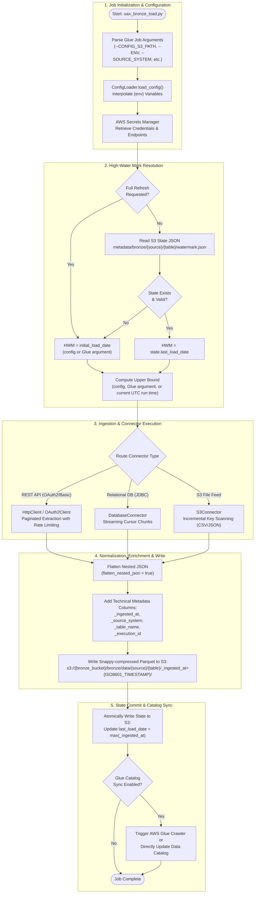

# Bronze Layer — Ingestion & Raw Lakehouse Engine

## 1. Executive Summary & Purpose

The **Bronze Layer** is the foundation of the Medallion Data Lakehouse architecture. Its sole responsibility is **high-fidelity, zero-loss, incremental raw data acquisition** from disparate upstream operational systems (REST APIs, relational databases, third-party SaaS vendors, and object stores) into an immutable, audit-ready data lake.

### Core Architectural Principles
* **Raw & Immutable**: Source payloads are ingested as-is without destructive business transformations. Raw structures are preserved for complete replayability and audit compliance.
* **Schema Decoupling via Flattening**: Deeply nested JSON payloads are deterministically flattened (e.g., `user.profile.id` $\to$ `user_profile_id`) using configurable separators to optimize downstream columnar scanning without losing nested attributes.
* **Partitioned Columnar Storage**: Raw data is stored in Apache Parquet format using Snappy compression, partitioned by run-level ingestion timestamp (`_ingested_at=<ISO8601_TIMESTAMP>/`) to guarantee deterministic incremental scans for Silver and optimize storage footprint.
* **Audit & Lineage Enrichment**: Every ingested record is stamped with technical metadata columns (`_ingested_at`, `_source_system`, `_table_name`, `_execution_id`).
* **Resilient Watermarking**: Per-table state files stored in Amazon S3 track incremental extraction boundaries (`last_load_date`, `upper_bound`), guaranteeing fault tolerance and idempotent restarts.

---

## 2. Low-Level Execution Lifecycle

The following Mermaid diagram outlines the end-to-end execution flow of the Bronze ingestion process:



---

## 3. Python Module Linkage & Architecture Rationale

The Bronze Layer is structured into standalone, modular Python components rather than a monolithic script.

```
bronze/
├── script/
│   ├── uax_bronze_load.py              # Main Glue job orchestrator entrypoint
│   ├── config_loader.py                # Centralized JSON parser & {env} interpolator
│   ├── config/
│   │   └── bronze_config.json          # Production configuration blueprint
│   └── connectors/
│       ├── __init__.py                 # Connector registry & CONNECTOR_MAP
│       ├── database.py                 # Relational database streaming connector
│       ├── genesys.py                  # Genesys Cloud Analytics API connector
│       ├── http_client.py              # Requests session manager, backoff & retry
│       ├── moveworks.py                # Moveworks Enterprise API connector
│       ├── oauth.py                    # Multi-grant OAuth2 client & token cache
│       ├── s3_file.py                  # S3 object ingestion connector (CSV/JSON/Parquet)
│       └── servicenow.py               # ServiceNow REST Table API connector
```

### Why Standalone Python Modules?
1. **Separation of Concerns**: Connectors are decoupled from the orchestration loop. A change in the ServiceNow API pagination logic never impacts relational database extraction.
2. **Independent Unit Testability**: Individual connectors, OAuth token lifecycle managers, and JSON flatteners can be tested in isolation using mocked HTTP responses without running a full Glue Spark context.
3. **Dynamic Connector Routing**: The orchestrator (`uax_bronze_load.py`) relies on `CONNECTOR_MAP` in `connectors/__init__.py` to instantiate the appropriate connector class at runtime based on the configuration key.
4. **Environment Isolation**: The `ConfigLoader` interpolates dynamic `{env}` variables across bucket names, database catalogs, and crawlers without hardcoding environment branches in the extraction code.

---

## 4. Comprehensive Authentication & Security Guide

The Bronze Layer connects to external corporate systems that enforce distinct security paradigms. The `connectors/` framework encapsulates these security mechanisms.

### 4.1 Authentication Protocols Matrix

| Upstream Source | Auth Type | Grant Type | Why Used? | Where Managed? | Token Refresh Mechanics |
| :--- | :--- | :--- | :--- | :--- | :--- |
| **Genesys Cloud** | `oauth` | `client_credentials` | Machine-to-machine enterprise analytics extraction requiring non-interactive API access. | AWS Secrets Manager | Proactive refresh: Re-authenticates 60 seconds before token expiry via `OAuth2Client`. |
| **Moveworks AI** | `oauth2` | `client_credentials` | Enterprise REST API security standard; scopes restricted to conversation telemetry. | AWS Secrets Manager | Proactive refresh with cached Bearer token in memory. |
| **ServiceNow** | `basic` or `oauth` | `client_credentials` / `password` | Legacy ServiceNow instances enforce Basic Auth; modern ITIL enterprise setups enforce OAuth2. | AWS Secrets Manager | In-memory header injection on all requests; automatic session pool reuse. |
| **PostgreSQL / MySQL** | `database` (JDBC) | N/A (User/Password) | Direct read-replica ingestion requiring direct TCP socket connectivity. | AWS Secrets Manager | Connection opened per batch via secure credentials; pooled and closed gracefully. |
| **Vendor S3 Feeds** | `iam_role` | N/A (AWS STS) | Cross-account S3 bucket reading via AWS IAM Role assumption or bucket policies. | AWS IAM | Handled natively by `boto3.client('s3')` using job role credentials. |

---

### 4.2 OAuth2 Grant Types Deep-Dive

#### 1. Client Credentials Grant (`grant_type = "client_credentials"`)
* **When & Why Used**: Designed for automated service-to-service communication where no human interaction or user context is required. It exchanges a `client_id` and `client_secret` directly for a short-lived Bearer access token.
* **Token Request Payload**:
  ```http
  POST {token_url} HTTP/1.1
  Host: auth.endpoint.com
  Content-Type: application/x-www-form-urlencoded

  grant_type=client_credentials&client_id={client_id}&client_secret={client_secret}
  ```
* **Engine Implementation (`oauth.py`)**:
  - The token is retrieved and cached in `OAuth2Client._token_cache`.
  - The client checks `is_expired` before every API invocation. If the remaining lifetime is $< 60$ seconds, it automatically re-requests a new access token before making the target API call.

#### 2. Resource Owner Password Credentials (`grant_type = "password"`)
* **When & Why Used**: Utilized when connecting to legacy enterprise systems that require service account user authentication combined with an OAuth client application.
* **Token Request Payload**:
  ```http
  POST {token_url} HTTP/1.1
  Content-Type: application/x-www-form-urlencoded

  grant_type=password&client_id={client_id}&client_secret={client_secret}&username={username}&password={password}
  ```

#### 3. Refresh Token Grant (`grant_type = "refresh_token"`)
* **When & Why Used**: Utilized when upstream identity providers issue short-lived access tokens (e.g., 15 minutes) alongside a long-lived refresh token to avoid passing client secrets across every handshake.
* **Token Request Payload**:
  ```http
  POST {token_url} HTTP/1.1
  Content-Type: application/x-www-form-urlencoded

  grant_type=refresh_token&client_id={client_id}&client_secret={client_secret}&refresh_token={refresh_token}
  ```

---

### 4.3 Secrets Manager Contract Schema

All sensitive credentials MUST reside in AWS Secrets Manager. Secrets are formatted as JSON key-value pairs matching the exact naming expected by each connector:

#### REST API (OAuth2 Client Credentials)
```json
{
  "auth_type": "oauth",
  "token_url": "https://login.mypurecloud.com/oauth/token",
  "client_id": "00000000-0000-0000-0000-000000000000",
  "client_secret": "abcdefghijklmnopqrstuvwxyz123456",
  "grant_type": "client_credentials",
  "api_base_url": "https://api.mypurecloud.com",
  "batch_size": "100"
}
```

#### REST API (Basic Authentication)
```json
{
  "auth_type": "basic",
  "api_base_url": "https://your-instance.service-now.com",
  "username": "svc_uax_datalake",
  "password": "SuperSecretPassword123!",
  "batch_size": "1000"
}
```

#### Relational Database (JDBC / Direct TCP)
```json
{
  "db_type": "postgresql",
  "host": "aurora-pg-cluster.prod.internal",
  "port": 5432,
  "dbname": "operational_db",
  "username": "ro_datalake_user",
  "password": "SecureDatabasePassword456!"
}
```

---

## 5. Low-Level Ingestion Mechanics & Connectors

### 5.1 REST API Pagination & Backoff (`http_client.py`)
* **Session Pooling**: Uses `urllib3.util.retry.Retry` with a configured backoff factor to automatically retry transient network failures (HTTP 500, 502, 503, 504).
* **Rate Limiting (HTTP 429)**: Inspects the upstream response headers for `Retry-After`. If present, the thread sleeps for the requested duration before retrying.
* **Pagination Strategies**:
  - **Offset/Limit**: ServiceNow uses `sysparm_offset` and `sysparm_limit`.
  - **Page Number**: Genesys uses `pageNumber` and `pageSize`.
  - **Window Sharding**: Moveworks splits long time ranges into discrete temporal windows (`shard_window_days: 15`) and queries parallel shards.

### 5.2 Relational Database Streaming (`database.py`)
* Ingests data incrementally using streaming cursors (`fetch_size: 10000`) to prevent out-of-memory (OOM) conditions on high-volume tables.
* Dynamic query synthesis:
  ```sql
  SELECT * FROM {table_name} WHERE {default_delta_filter} ORDER BY updated_at ASC
  ```

### 5.3 S3 File Ingestion (`s3_file.py`)
* Connects to external S3 buckets containing vendor drops.
* Modes supported via `fetch_mode`:
  - `all`: Ingests all files whose `LastModified` timestamp is greater than the watermark.
  - `latest`: Identifies and processes only the single most recently modified file (ideal for daily full snapshots).

---

## 6. High-Water Mark & State Management

Incremental extraction relies on an S3-persisted JSON state file per table:
`s3://{state_bucket}/metadata/bronze/{source}/{table}/watermark.json`

### State File Schema
```json
{
  "source_system": "genesys",
  "table_name": "conversations",
  "last_load_date": "2026-03-24 08:00:00",
  "upper_bound": "2026-03-24 10:00:00",
  "last_status": "SUCCESS",
  "records_ingested": 14250,
  "last_updated_at": "2026-03-24T10:05:12.345678+00:00"
}
```

### Watermark Computation Rules
1. **Cold Start**: If no state file exists in S3, the job reads `tables.<table_name>.initial_load_date` from `bronze_config.json`. If missing, it checks `pipeline_defaults.default_initial_load_date` or fails fast.
2. **Delta Ingestion**: If a valid state file exists, `last_load_date` is read from S3. Extraction filters data where `record_timestamp >= last_load_date`.
3. **Upper Bound**: If configured, limits the upper boundary of the query (`record_timestamp <= upper_bound`). If blank, it defaults to the current UTC run timestamp.
4. **Atomic Commit**: The state file is updated **only after** Parquet data has been successfully written to S3. If an extraction fails halfway, the state remains at the prior watermark, ensuring zero data loss on restart.

---

## 7. Developer Onboarding: Adding a New Source or Table

Follow this step-by-step procedure to onboard a new source or table in the Bronze Layer:

### Step 1: Create AWS Secrets Manager Entry
Store the connection credentials under the standardized secret path:
`uax-datalake/{source_name}-credentials-{env}` (matching the schema defined in Section 4.3).

### Step 2: Update `bronze_config.json`
Add the new source block under `source_systems` or append a table under an existing source:
```json
"source_systems": {
  "new_api_source": {
    "base_url": "https://api.vendor.com",
    "api_endpoint_template": "/v1/data/{table_name}",
    "default_delta_filter": "updated_at>={last_load_date}",
    "response_records_key": "data",
    "batch_size": 500,
    "tables": {
      "audit_events": {
        "initial_load_date": "2026-01-01 00:00:00",
        "upper_bound": ""
      }
    }
  }
}
```

### Step 3: Implement Custom Connector (If Not a Standard REST/DB/S3 Source)
If the upstream source requires custom protocol handling:
1. Create `bronze/script/connectors/new_source.py` implementing the classmethod `fetch_delta()`.
2. Register the connector in `bronze/script/connectors/__init__.py` under `CONNECTOR_MAP`.

### Step 4: Execute & Validate via AWS Glue Job Run
```bash
aws glue start-job-run \
  --job-name "glue-bronze-new_api_source-dev" \
  --arguments '{
    "--JOB_NAME": "glue-bronze-new_api_source-dev",
    "--SOURCE_SYSTEM": "new_api_source",
    "--ENV": "dev",
    "--SOURCE_TABLE_NAME": "audit_events",
    "--CONFIG_S3_PATH": "s3://uax-datalake-config-dev/bronze/config/bronze_config.json",
    "--BRONZE_BUCKET": "uax-datalake-bronze-dev",
    "--STATE_BUCKET": "uax-datalake-state-dev"
  }'
```

#### AWS Glue Arguments Specification:
* **Mandatory Glue Arguments:**
  * `--JOB_NAME`: Unique AWS Glue job name.
  * `--SOURCE_SYSTEM`: Target source identifier (e.g. `servicenow`, `genesys`, `moveworks`, `new_api_source`).
* **Optional Glue Arguments (Fallback to `bronze_config.json` if omitted):**
  * `--ENV`: Target environment (`dev`, `stage`, `prod`; default: `dev`).
  * `--CONFIG_S3_PATH`: S3 path to `bronze_config.json`.
  * `--SOURCE_TABLE_NAME`: Specific table(s) to extract (comma-separated; processes all configured source tables if omitted).
  * `--BRONZE_BUCKET`: Target S3 bucket for Parquet output (fallback: `pipeline_defaults.bronze_bucket`).
  * `--STATE_BUCKET`: S3 bucket storing state watermarks (fallback: `pipeline_defaults.state_bucket`).
  * `--SECRET_NAME`: AWS Secrets Manager secret holding credentials (fallback: `source_config.secret_name`).
  * `--BATCH_SIZE`: Page size (fallback: `source_config.batch_size` or default 1000).
  * `--INITIAL_LOAD_DATE`: Override initial extraction timestamp.
  * `--UPPER_BOUND`: Override upper extraction timestamp cutoff.
  * `--FLATTEN_NESTED_JSON`: Enable/disable recursive JSON flattening (`true`/`false`).
  * `--ERROR_HANDLING_MODE`: `CONTINUE_ON_ERROR` or `HALT_ON_ERROR`.

Verify that:
1. Parquet files appear under `s3://uax-datalake-bronze-dev/bronze/data/new_api_source/audit_events/_ingested_at={ISO8601_TIMESTAMP}/`.
2. The state file is committed at `s3://uax-datalake-state-dev/metadata/bronze/new_api_source/audit_events/watermark.json`.

---

## 8. Developer Enhancement Reference

For information on how the Bronze codebase is structured for contributors — adding connectors, extending the orchestration loop, or writing unit tests — see [ENHANCEMENT_GUIDE.md](ENHANCEMENT_GUIDE.md).
