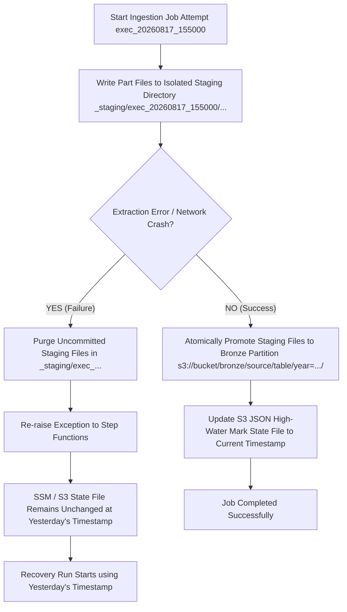

# AWS Glue Dynamic Data Ingestion Framework Architecture

This document details the design, atomic staging pattern, failure recovery, idempotency safeguards, and security model for the **AWS Glue Python Shell Incremental Data Ingestion Framework**.

---

## 1. Failure Recovery & Zero-Duplicate Data Ingestion Policy

When a Glue job fails mid-run (e.g., after writing part 1 and part 2, but crashing on part 3 due to a network glitch or timeout), the pipeline guarantees **100% Idempotent Execution** and **Zero Duplicate Files** in Bronze using an **Atomic Staging Directory Strategy**.

### Failure Recovery Workflow



---

## 2. Atomic Staging Directory Design

### Step 1: Write to Staging Prefix
During data extraction, chunked part files are written to an isolated execution-scoped staging prefix:
```text
s3://<bronze_bucket>/_staging/exec_<timestamp>/<source_system>/<table_name>/delta_<timestamp>_part_0001.json
s3://<bronze_bucket>/_staging/exec_<timestamp>/<source_system>/<table_name>/delta_<timestamp>_part_0002.json
```

### Step 2: Atomic Promotion (On Success)
If all pages and chunks for a table succeed:
1. Files are copied from `_staging/exec_<timestamp>/...` to final Hive partition:
   ```text
   s3://<bronze_bucket>/bronze/<source_system>/<table_name>/year=YYYY/month=MM/day=DD/delta_<timestamp>_part_0001.json
   s3://<bronze_bucket>/bronze/<source_system>/<table_name>/year=YYYY/month=MM/day=DD/delta_<timestamp>_part_0002.json
   ```
2. Temporary staging files are purged.
3. The S3 High-Water Mark JSON state file (`metadata/<source>/<table_name>/watermark.json`) is updated.

### Step 3: Purge Staging (On Failure)
If any exception occurs mid-run:
1. The `except` block catches the error and purges `_staging/exec_<timestamp>/...`.
2. Active Bronze partition keys remain untouched.
3. High-Water Mark state file remains at the previous successful load date.
4. When Step Functions retries the job (Recovery Run), it re-fetches from the un-updated High-Water Mark date into a fresh staging directory, ensuring **zero duplicate files** or corrupt partial loads in Bronze!

---

## 3. Audit Metadata & Parquet Storage Format

### Ingestion Audit Metadata Injection
Before writing record chunks to S3, every dict record is automatically enriched with audit lineage attributes:
```json
{
  "_ingested_at": "2026-08-17T16:40:00Z",
  "_source_system": "servicenow",
  "_table_name": "incident",
  "_execution_id": "20260817_164000",
  "sys_id": "b10a29...",
  "number": "INC0010001"
}
```

### Parquet + Snappy Compression
- **File Format**: Parquet columnar format with **Snappy Compression** (`.parquet`).
- **Pathing**: `s3://<bronze_bucket>/bronze/<source_system>/<table_name>/year=YYYY/month=MM/day=DD/delta_<exec_id>_part_0001.parquet`
- **Fallback**: Graceful fallback to formatted JSON (`.json`) if columnar dependencies are unavailable.

---

## 4. Multi-Table Resiliency & CloudWatch Monitoring

### Error Handling Policies (`CONTINUE_ON_ERROR` vs `HALT_ON_ERROR`)
- **`CONTINUE_ON_ERROR`**: Logs failure for individual tables, purges staging for failed tables, continues extracting remaining requested tables, and throws a summarized exception at the end.
- **`HALT_ON_ERROR`**: Halts immediately on the first table failure.

### CloudWatch Custom Metrics (`UAX/DataPipeline/Ingestion`)
The job automatically reports custom operational metrics to CloudWatch under namespace `UAX/DataPipeline/Ingestion`:
- `RecordsIngested` (Count) - Dimensions: `SourceSystem`, `TableName`
- `IngestionDurationSeconds` (Seconds) - Dimensions: `SourceSystem`, `TableName`
- `TableExtractionSuccess` (1 = Success, 0 = Failure) - Dimensions: `SourceSystem`, `TableName`

---

## 5. Silver Layer Deduplication Safeguard (Medallion Architecture)

Even if a raw Bronze layer accumulates duplicate records across retries, downstream Silver layer ETL transformations use SQL deduplication windows:
```sql
SELECT *
FROM (
  SELECT *,
         ROW_NUMBER() OVER (PARTITION BY sys_id ORDER BY sys_updated_on DESC) as rn
  FROM bronze_servicenow_incident
)
WHERE rn = 1;
```
This guarantees **100% duplicate-free analytics tables** in Silver and Gold layers.
