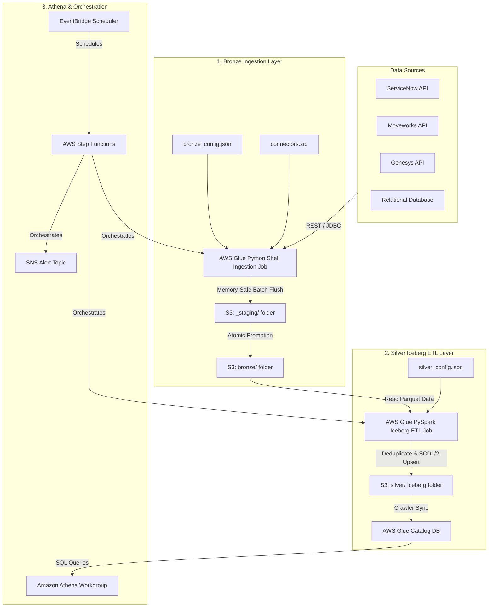

# HR-Datalake Pipeline: Low-Level Design (LLD)

This document provides a low-level, file-by-file design specification detailing the purpose, logic, function definitions, connectivity, and implementation details for every component of the **HR-Datalake Pipeline**.

---

## 🏗️ 1. System Architecture & Data Flow

The architecture follows the **Medallion design pattern** (Bronze -> Silver) with a centralized S3 Bucket, orchestration via Step Functions, and query capabilities via Amazon Athena.



---

## 📁 2. Detailed File-by-File Specification

---

### 🗂️ A. Terraform Infrastructure Layer (`terraform/`)

#### 1. [`1_bronze/bronze.tf`](file:///Users/nilkamalmahato/Documents/Data-pipeline/terraform/1_bronze/bronze.tf)
*   **Purpose**: Provisions all Bronze-layer core services and data lake storage foundations.
*   **Why we care**: Sets up the S3 bucket where all data and scripts reside, configures Secrets Manager to securely hold API authentication credentials, establishes the IAM execution permissions for both Bronze and Silver Glue jobs, and registers the Bronze Glue job.
*   **Variables Defined**:
    *   `aws_region` (Default: `us-east-1`): Deployment AWS region.
    *   `environment` (Default: `dev`): Environment name used as a resource naming suffix.
    *   `app_name` (Default: `hr-datalake`): Central project prefix.
    *   `data_lake_bucket_name` (Default: `uax-data-lake-bucket`): Core S3 bucket identifier.
    *   `output_format` (Default: `parquet`): Output file format.
    *   `use_existing_s3_bucket`, `use_existing_iam_role`, `use_existing_secrets` (Default: `false`): Toggles to skip resource creation and reuse existing resources in AWS.
*   **Key Resources Created**:
    *   `aws_s3_bucket.bucket`: Main storage container for data, scripts, and logs.
    *   `aws_secretsmanager_secret.servicenow_secret` / `moveworks_secret` / `genesys_secret`: Secure containers for API credentials.
    *   `aws_iam_role.glue_execution_role`: Role assumed by AWS Glue for S3, Secrets, Catalog, and CloudWatch access.
    *   `aws_glue_job.bronze_ingestion_job`: Python Shell job running `uax_bronze_load.py`.
*   **Connectivity**: References S3 path locations and Secrets Manager resource identifiers.

#### 2. [`2_silver/silver.tf`](file:///Users/nilkamalmahato/Documents/Data-pipeline/terraform/2_silver/silver.tf)
*   **Purpose**: Provisions Silver Iceberg ETL compute and schema registry catalog resources.
*   **Why we care**: Sets up the database catalog schema where final analytical tables are queried, creates the crawler to scan Iceberg metadata, and deploys the PySpark Spark job that performs data deduplication and UPSERT execution.
*   **Variables Defined**:
    *   `aws_region`, `environment`, `app_name`, `data_lake_bucket_name`.
    *   `use_existing_glue_database` (Default: `false`): Toggle to skip Glue Database creation.
*   **Key Resources Created**:
    *   `aws_glue_catalog_database.silver_db`: Logical Glue Data Catalog database.
    *   `aws_glue_crawler.silver_iceberg_crawler`: Scans S3 `silver/` folders to auto-update Catalog schemas.
    *   `aws_glue_job.silver_iceberg_job`: PySpark Glue 4.0 job running `silver_iceberg_etl.py`.
*   **Connectivity**: Uses `glue_role_arn` output from the Bronze layer to execute PySpark jobs and crawl data.

#### 3. [`3_athena/athena.tf`](file:///Users/nilkamalmahato/Documents/Data-pipeline/terraform/3_athena/athena.tf)
*   **Purpose**: Configures analytical query access workspaces.
*   **Why we care**: Establishes a dedicated workgroup in Amazon Athena, enforcing query result storage isolation and logging configurations.
*   **Variables Defined**:
    *   `aws_region`, `environment`, `app_name`, `data_lake_bucket_name`.
    *   `use_existing_athena_workgroup` (Default: `false`): Toggle to reuse workgroups.
*   **Key Resources Created**:
    *   `aws_athena_workgroup.data_pipeline`: Analytics workgroup settings enforcing queries output to `s3://<bucket>/athena-results/`.
*   **Connectivity**: Integrates with the S3 bucket created in the Bronze layer for result storage.

#### 4. [`4_step_functions/step_functions.tf`](file:///Users/nilkamalmahato/Documents/Data-pipeline/terraform/4_step_functions/step_functions.tf)
*   **Purpose**: Manages end-to-end cron scheduling, orchestration, and alerts.
*   **Why we care**: Builds the automated workflow engine that coordinates Bronze extraction, Silver transformations, schema catalog updates, and failure notifications.
*   **Variables Defined**:
    *   `aws_region`, `environment`, `app_name`, `data_lake_bucket_name`, `alert_email_address`, `schedule_expression`.
    *   `use_existing_sns_topic`, `use_existing_step_functions_role` (Default: `false`).
*   **Key Resources Created**:
    *   `aws_sns_topic.pipeline_alerts`: Central notification topic.
    *   `aws_sns_topic_subscription.email_alert`: Subscribes the operations email to notifications.
    *   `aws_sfn_state_machine.servicenow_orchestrator` / `moveworks_orchestrator` / `genesys_orchestrator`: Independent Step Function State Machines.
    *   `aws_cloudwatch_event_rule.servicenow_cron` / `moveworks_cron` / `genesys_cron`: EventBridge scheduled rules triggering the State Machines.
*   **Connectivity**: Connects with Bronze/Silver Glue jobs to trigger them sequentially.

---

### 🗂️ B. Bronze Ingestion Layer (`bronze/script/`)

#### 1. [`config_loader.py`](file:///Users/nilkamalmahato/Documents/Data-pipeline/bronze/script/config_loader.py)
*   **Purpose**: Central configuration manager that parses [`bronze_config.json`](file:///Users/nilkamalmahato/Documents/Data-pipeline/bronze/script/config/bronze_config.json).
*   **Why we care**: Standardizes how configuration rules are loaded. It allows pulling the JSON file from S3 dynamically or falling back to local files for testing.
*   **Class Methods & Logic**:
    *   `load_config(config_s3_path, s3_client)`: Downloads the JSON file from S3 if configured; otherwise, looks for a local configuration file in `config/` or `bronze/script/config/`.
    *   `get_source_config(source_system, config_dict)`: Extracts general configurations for a source system.
    *   `get_table_initial_load_date(source_system, table_name, config_dict)`: Resolves table-specific initial run load dates. If missing/null, raises a `ValueError` (Strict Validation).
    *   `get_table_query_filter(source_system, table_name, last_load_date, config_dict)`: Constructs query filters for API calls, merging delta filters with updated HWMs.
    *   `get_table_endpoint(source_system, table_name, config_dict)`: Interpolates URI paths for dynamic API extraction.
    *   `get_pipeline_defaults(config_dict)`: Extracts fallback system defaults (chunk size, formats).

#### 2. [`uax_bronze_load.py`](file:///Users/nilkamalmahato/Documents/Data-pipeline/bronze/script/uax_bronze_load.py)
*   **Purpose**: Orchestrates incremental extraction, pagination, state updates, and data writing.
*   **Why we care**: The primary ingestion driver. It runs REST queries, parses payloads, flattens JSON structures, writes Parquet chunks to staging, promotes files, and updates watermarks.
*   **Core Functions**:
    *   `get_secret(secret_name)`: Fetches API secrets from AWS Secrets Manager.
    *   `parse_arguments()`: Parses job parameters (CLI overrides, Step Function settings). Merges them on top of the loaded JSON configuration.
    *   `flatten_dict(d, parent_key, sep)`: Flattens nested JSON payloads recursively. Converts arrays/objects to dotted/underscored strings for simple relational schemas.
    *   `serialize_chunk_to_bytes(records_chunk, output_format, compression)`: Serializes records using Pandas/PyArrow to Parquet or JSON bytes.
    *   `emit_cloudwatch_metrics(namespace, metrics)`: Submits custom pipeline performance metrics to AWS CloudWatch.
    *   `get_last_load_date(state_bucket, state_key, default_date)`: Reads the watermark file from S3 to retrieve the last successful ingestion timestamp.
    *   `update_last_load_date(state_bucket, state_key, ...)`: Overwrites the watermark JSON state on S3 with the new HWM timestamp.
    *   `promote_staging_to_bronze(bucket_name, staging_prefix, final_partition_prefix)`: Moves files from staging to target directories atomically.
    *   `cleanup_failed_staging(bucket_name, staging_prefix)`: Clears the staging prefix if errors occur to prevent duplicate ingestion.
    *   `main()`: Main orchestration driver. Fetches HWM, calls connector classes, processes pagination, flushes bytes to S3, and updates high-water marks.

---

### 🗂️ C. Ingestion Connector Plugins (`bronze/script/connectors/`)

#### 1. [`connectors/__init__.py`](file:///Users/nilkamalmahato/Documents/Data-pipeline/bronze/script/connectors/__init__.py)
*   **Purpose**: Factory interface registry for connector classes.
*   **Why we care**: Decouples the core execution handler from target API platforms. Adding new connectors only requires registry updates.
*   **Functions**:
    *   `get_connector(source_system)`: Looks up and initializes the appropriate connector subclass (`ServiceNowConnector`, `GenesysConnector`, `MoveworksConnector`, `DatabaseConnector`).

#### 2. [`connectors/http_client.py`](file:///Users/nilkamalmahato/Documents/Data-pipeline/bronze/script/connectors/http_client.py)
*   **Purpose**: Managed HTTP client helper wrapping standard Python Requests.
*   **Why we care**: Centralizes authentication, error handling, rate limiting, and token management.
*   **Core Methods**:
    *   `get(url, params)`: Sends HTTP GET requests. Automatically retries with exponential backoff on connection errors or 5xx failures. If it receives a `401 Unauthorized`, it calls `_refresh_token()` and retries.
    *   `_refresh_token()`: Fetches a new token using `OAuth2Client` and resets authorization headers.

#### 3. [`connectors/oauth.py`](file:///Users/nilkamalmahato/Documents/Data-pipeline/bronze/script/connectors/oauth.py)
*   **Purpose**: Token acquisition engine for OAuth 2.0 protocols.
*   **Why we care**: Standardizes token requests across multiple credential workflows (Client Credentials, Password, and Refresh Tokens).
*   **Core Methods**:
    *   `get_access_token()`: Returns a valid cached token if available; otherwise, requests a new one.
    *   `_request_new_token()`: Sends POST requests to token URLs, parse responses, and updates local cache.

#### 4. [`connectors/servicenow.py`](file:///Users/nilkamalmahato/Documents/Data-pipeline/bronze/script/connectors/servicenow.py)
*   **Purpose**: ServiceNow REST API data extractor.
*   **Why we care**: Implements ServiceNow offset pagination rules (`sysparm_offset`, `sysparm_limit`) and ServiceNow-specific delta filters.
*   **Core Methods**:
    *   `extract_data(table_name, last_load_date, batch_size, ...)`: Iterates through offset-based pages, extracts records, and returns them to the ingestion handler.

#### 5. [`connectors/genesys.py`](file:///Users/nilkamalmahato/Documents/Data-pipeline/bronze/script/connectors/genesys.py)
*   **Purpose**: Genesys PureCloud platform API connector.
*   **Why we care**: Manages Genesys-specific page-number pagination (`pageNumber`, `pageSize`) and handles Genesys' query parameters.
*   **Core Methods**:
    *   `extract_data(...)`: Runs query loops using Genesys page-number rules.

#### 6. [`connectors/moveworks.py`](file:///Users/nilkamalmahato/Documents/Data-pipeline/bronze/script/connectors/moveworks.py)
*   **Purpose**: Moveworks export endpoint data extractor.
*   **Why we care**: Handles OData filter standards (`$filter=updated_at gt '...'`) and enforces loop limits to avoid infinite calls.
*   **Core Methods**:
    *   `extract_data(...)`: Performs data extraction based on Moveworks OData specifications.

#### 7. [`connectors/database.py`](file:///Users/nilkamalmahato/Documents/Data-pipeline/bronze/script/connectors/database.py)
*   **Purpose**: Relational database connector using Python PEP 249 database APIs (e.g. `psycopg2`, `pymysql`).
*   **Why we care**: Ingests database tables directly using query limits, pagination cursors, and custom query overrides.
*   **Core Methods**:
    *   `extract_data(...)`: Establishes DB connections, executes pagination queries, and extracts database rows.

---

### 🗂️ D. Silver Transformation Layer (`silver/script/`)

#### 1. [`silver_config_loader.py`](file:///Users/nilkamalmahato/Documents/Data-pipeline/silver/script/silver_config_loader.py)
*   **Purpose**: Configuration parser for [`silver_config.json`](file:///Users/nilkamalmahato/Documents/Data-pipeline/silver/script/config/silver_config.json).
*   **Why we care**: Standardizes how PySpark ETL jobs access deduplication keys, target Iceberg tables, transform rules, and merge strategy selections.
*   **Class Methods**:
    *   `load_config(config_s3_path, s3_client)`: Downloads the Silver configuration from S3 or falls back to local files.
    *   `get_source_config(source_system, config_dict)`: Retrieves configuration details for a source.
    *   `get_table_config(source_system, table_name, config_dict)`: Extracts settings like primary keys and SCD types for a specific table.

#### 2. [`silver_iceberg_etl.py`](file:///Users/nilkamalmahato/Documents/Data-pipeline/silver/script/silver_iceberg_etl.py)
*   **Purpose**: PySpark Iceberg ETL script.
*   **Why we care**: Executes core data cleaning, schema mapping, record deduplication, and writes to Apache Iceberg tables.
*   **Core Functions**:
    *   `parse_spark_arguments()`: Resolves PySpark variables, supporting parameter overrides from CLI/Step Functions.
    *   `perform_deduplication(df, pk_keys, order_cols, strategy)`: Resolves primary key duplicates using window functions:
        `row_number().over(Window.partitionBy(pk_keys).orderBy(order_cols.desc())) == 1`.
    *   `execute_iceberg_scd1_upsert(spark, df, ...)`: Updates matching records and inserts new ones using Iceberg `MERGE INTO` SQL structures (SCD Type 1).
    *   `execute_iceberg_scd2(spark, df, ...)`: Tracks history by closing old versions and inserting new active rows (SCD Type 2).
    *   `main()`: Main PySpark ETL driver. Parses parameters, loads configurations, runs deduplications and transformations, and updates target Iceberg tables.

#### 3. [`transformer.py`](file:///Users/nilkamalmahato/Documents/Data-pipeline/silver/script/transformer.py)
*   **Purpose**: Transformation manager that handles schema casts and custom scripts.
*   **Why we care**: Decouples simple column mapping rules from complex custom transformations.
*   **Class Methods**:
    *   `apply_transformations(df, table_config, spark)`: Casts data types, maps columns, and runs custom PySpark scripts if configured.
    *   `_apply_custom_script(df, script_path, spark)`: Dynamically loads and runs custom transform modules.

#### 4. [`custom_transforms/servicenow_incident.py`](file:///Users/nilkamalmahato/Documents/Data-pipeline/silver/script/custom_transforms/servicenow_incident.py)
*   **Purpose**: Custom transformation module.
*   **Why we care**: Implements custom rules, such as cleaning up fields or adding processing timestamps, for ServiceNow Incident data.
*   **Functions**:
    *   `transform(df, spark)`: Custom transform implementation returned to the transformer.

---

## 🔗 3. System Connectivity & Execution Flow

```text
1. EventBridge Rule triggers the Step Function State Machine (e.g. servicenow_orchestrator).
   │
   ├── 2. Step Functions starts AWS Glue Job (hr-datalake-bronze-ingestion-dev)
   │      │
   │      ├── a. Glue Job parses CLI parameters & loads bronze_config.json.
   │      ├── b. Calls get_secret() to retrieve credentials.
   │      ├── c. Reads watermark.json from S3 metadata folder.
   │      ├── d. Calls get_connector() to initialize client (e.g. ServiceNowConnector).
   │      ├── e. Runs HTTP GET requests with pagination.
   │      ├── f. Flattens JSON and saves Parquet batches to _staging/ folder in S3.
   │      ├── g. Promotes files to final partition path: s3://bucket/bronze/servicenow/incident/...
   │      ├── h. Emits CloudWatch custom metrics.
   │      └── i. Updates HWM timestamp in watermark.json.
   │
   ├── 3. Step Functions starts AWS Glue PySpark Job (hr-datalake-silver-iceberg-etl-dev)
   │      │
   │      ├── a. Job reads raw Parquet files from S3 bronze/ partition.
   │      ├── b. Reads silver_config.json and gets deduplication configurations.
   │      ├── c. Runs window function to remove duplicate rows.
   │      ├── d. Applies data transforms (transformer.py & custom_transforms/).
   │      └── e. Performs MERGE INTO SQL to write UPSERTs or SCD2 history to Iceberg tables.
   │
   ├── 4. Step Functions runs AWS Glue Crawler to update schemas in database uax_data_lake_db_dev.
   │
   └── 5. Step Functions triggers SNS alert email to notify stakeholders of success or failure.
```
