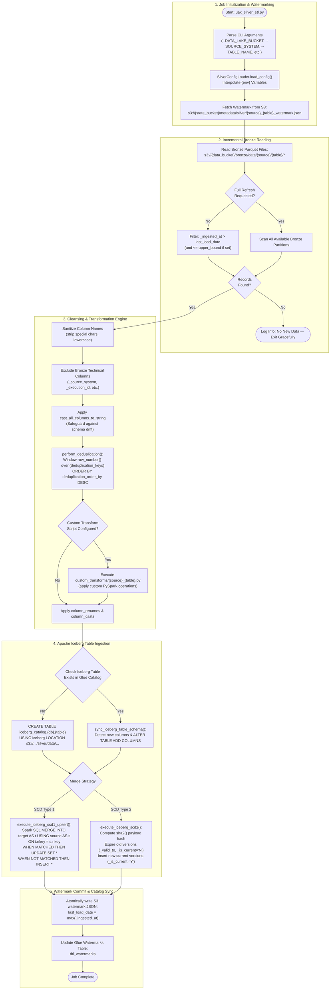

# Silver Layer — Conformed Apache Iceberg Lakehouse Engine

## 1. Executive Summary & Purpose

The **Silver Layer** serves as the conformed, cleansed, and curated data foundation of the Medallion Data Lakehouse. It transforms raw, immutable Bronze Parquet files into ACID-compliant **Apache Iceberg (v2)** tables registered in the AWS Glue Data Catalog.

### Core Architectural Responsibilities
* **Incremental Watermark Filtering**: Reads only newly arrived Bronze Parquet data partition by partition based on `_ingested_at > last_watermark`.
* **Stateful Deduplication**: Resolves duplicate records within micro-batches using natural/composite keys (`deduplication_keys`) and deterministic order columns (`deduplication_order_by`).
* **Declarative & Custom Schema Cleansing**:
  - Enforces uniform string casting (`cast_all_columns_to_string: true`) across incoming string fields to prevent Parquet schema mismatch crashes.
  - Applies declarative column renaming (`column_renames`) and type casting (`column_casts`).
  - Supports pluggable custom Python transformation scripts (`custom_transforms/*.py`).
* **ACID Merges (SCD1 & SCD2)**:
  - **SCD Type 1 (In-Place UPSERT)**: Performs native Spark SQL `MERGE INTO` Iceberg operations to update existing records and insert new ones.
  - **SCD Type 2 (Historical Audit Tracking)**: Tracks dimensional changes over time by maintaining version intervals (`_valid_from`, `_valid_to`, `_is_current`) and SHA-256 payload change-detection hashing.
* **Automatic Schema Evolution**: Detects new incoming columns and automatically executes `ALTER TABLE ... ADD COLUMNS` on the Iceberg catalog before executing merge operations.

---

## 2. Low-Level Execution Lifecycle

The following Mermaid diagram illustrates the Silver execution pipeline:



---

## 3. Python Module Linkage & File Organization

```
silver/
├── script/
│   ├── uax_silver_etl.py              # Main Glue PySpark execution engine
│   ├── silver_config_loader.py        # Silver JSON configuration loader & caching
│   ├── transformer.py                 # Declarative transformation rules engine
│   ├── config/
│   │   └── silver_config.json         # Complete Silver layer table definitions
│   └── custom_transforms/             # Source-specific transformation hooks
│       ├── servicenow_incident.py     # Custom Incident transformations
│       └── genesys_conversations.py   # Custom Genesys transcript/metric parsing
```

### Why Standalone Python Modules?
1. **Config Decoupling (`silver_config_loader.py`)**: Reads `silver_config.json` once, evaluates environment substitutions (`{env}`), and caches configuration objects across multi-table executions.
2. **Standardized Transformer Engine (`transformer.py`)**: Encapsulates common transformation logic (casting, hashing, column pruning) away from the Iceberg storage and merge code.
3. **Pluggable Custom Transformations (`custom_transforms/`)**: Source-specific domain logic (e.g. flattening Genesys metric arrays or parsing ServiceNow nested workflow logs) is maintained in isolated files without touching the core ETL pipeline engine.

---

## 4. Apache Iceberg Table Mechanics & Storage Layout

Silver tables are persisted using **Apache Iceberg v2 format** with S3 storage paths:
`s3://{silver_bucket}/silver/data/{source_system}/{table_name}/`

### 4.1 Iceberg Storage Structure
```
s3://uax-datalake-silver-dev/silver/data/servicenow/tbl_incident/
├── data/
│   ├── 00000-0-a1b2c3d4-data.parquet
│   └── 00001-0-e5f6g7h8-data.parquet
└── metadata/
    ├── v1.metadata.json
    ├── v2.metadata.json
    ├── snap-123456789-1-manifest-list.avro
    └── 123456789-m0.avro
```

### 4.2 Why AWS Glue Crawlers Are Disabled for Silver Iceberg
In `silver_config.json`, `glue_catalog.trigger_crawler` is explicitly set to `false`.
* **Standard crawlers corrupt Iceberg catalogs**: Standard Glue crawlers crawl both `/data` and `/metadata` directories, inadvertently generating duplicate or broken schema tables.
* **Native Spark Catalog Registration**: When Spark executes Iceberg DDL (`CREATE TABLE iceberg_catalog.{db}.{table}`), the Spark-Iceberg runtime natively writes atomic Iceberg metadata pointers directly into the AWS Glue Data Catalog.

---

## 5. Deduplication, SCD Type 1, and SCD Type 2 Details

### 5.1 In-Batch Deduplication (`perform_deduplication`)
Before executing any merge against the target Iceberg table, incoming Bronze micro-batches are deduplicated in-memory using Spark windowing:
```python
window_spec = Window.partitionBy(*nkeys).orderBy(*[col(c).desc() for c in order_cols])
deduped_df = df.withColumn("_row_num", row_number().over(window_spec)) \
               .filter(col("_row_num") == 1) \
               .drop("_row_num")
```

### 5.2 SCD Type 1: In-Place UPSERT
Used for operational entities where only the latest state is required (e.g., ticket status, user profile).
* **Target SQL Template**:
  ```sql
  MERGE INTO iceberg_catalog.{database}.{target_table} AS t
  USING source_staging AS s
  ON t.{nkey} = s.{nkey}
  WHEN MATCHED THEN
    UPDATE SET t.column_a = s.column_a, t._updated_at = current_timestamp()
  WHEN NOT MATCHED THEN
    INSERT *
  ```

### 5.3 SCD Type 2: Historical Version Tracking
Used for auditing dimensional attributes over time (e.g., employee department changes, SLA priority shifts).
* **Technical Columns Added**:
  - `_valid_from`: Timestamp when the record version became active.
  - `_valid_to`: Timestamp when the record version was superseded (defaults to `9999-01-01 00:00:00` for active records).
  - `_is_current`: String flag — `'Y'` for the active (current) version of the record, `'N'` for historical (expired) versions.
  - `_is_deleted`: String flag — `'Y'` for soft-deleted records, `'N'` for active records.
  - `_row_hash`: SHA-256 hash across all business payload columns. If the hash hasn't changed, no new SCD2 version is generated.

---

## 6. High-Water Mark & State Management

Incremental ingestion state is tracked in Amazon S3:
`s3://{state_bucket}/metadata/silver/{source}_{table}_watermark.json`

### Watermark Schema
```json
{
  "source_system": "servicenow",
  "table_name": "tbl_incident",
  "last_load_date": "2026-03-24 10:15:00",
  "records_processed": 3500,
  "last_updated_at": "2026-03-24T10:18:22.123456+00:00",
  "status": "SUCCESS"
}
```
During each execution:
1. `get_silver_last_load_date()` reads the state file.
2. Incoming Bronze records are filtered where `_ingested_at > last_load_date`.
3. After the Iceberg commit finishes successfully, `update_silver_watermark()` commits the new maximum `_ingested_at` back to S3.

---

## 7. Developer Onboarding: Adding a New Silver Table

### Step 1: Update `silver_config.json`
Define the table under `source_systems.<source>.tables`:
```json
"tbl_new_entity": {
  "source_table_name": "raw_tbl_new_entity",
  "nkey": "entity_id",
  "deduplication_keys": ["entity_id"],
  "deduplication_order_by": ["updated_at", "_ingested_at"],
  "merge_strategy": "upsert",
  "scd_type": "scd1",
  "column_renames": {
    "legacy_id": "system_id"
  },
  "column_casts": {
    "amount": "decimal(18,2)"
  }
}
```

### Step 2: (Optional) Implement Custom Transform Script
If complex business logic is needed:
1. Create `silver/script/custom_transforms/new_entity.py`.
2. Implement `def transform(df: DataFrame) -> DataFrame:`.
3. Reference the script path in `silver_config.json` under `custom_transform_script`.

### Step 3: Run & Validate
```bash
python3 silver/script/uax_silver_etl.py \
  --CONFIG_S3_PATH "s3://uax-datalake-config-dev/silver/config/silver_config.json" \
  --ENV "dev" \
  --SOURCE_SYSTEM "servicenow" \
  --TABLE_NAME "tbl_new_entity" \
  --DATA_LAKE_BUCKET "uax-datalake-silver-dev" \
  --STATE_BUCKET "uax-datalake-state-dev"
```
Verify via Amazon Athena:
```sql
SELECT * FROM "uax_datalake_db_dev"."tbl_new_entity" LIMIT 10;
```

---

## 8. Developer Enhancement Reference

For information on how the Silver codebase is structured for contributors — adding tables, writing custom transforms, or extending SCD logic — see [ENHANCEMENT_GUIDE.md](ENHANCEMENT_GUIDE.md).
