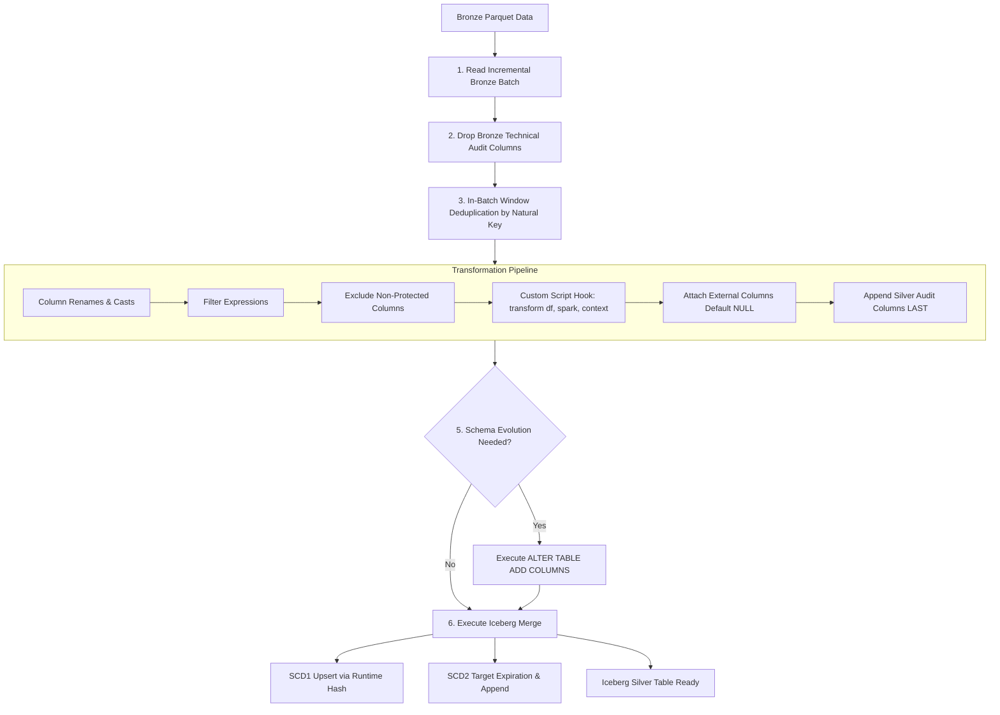

# Silver Layer — Master Guide & Custom Transformation Reference

> **Scope**: UAX Data Lake Pipeline · Silver Transformation & Iceberg Storage Layer  
> **Stack**: AWS Glue PySpark (Glue 4.0 / Spark 3.3+) · Apache Iceberg · S3 · AWS Secrets Manager · Glue Data Catalog

---

## Table of Contents

1. [What Is the Silver Layer?](#1-what-is-the-silver-layer)
2. [Directory Layout](#2-directory-layout)
3. [Silver Ingestion & Processing Flow](#3-silver-ingestion--processing-flow)
4. [Key Configuration Concepts](#4-key-configuration-concepts)
   - [Natural Keys (`nkey`) & Composite Key Support](#natural-keys-nkey--composite-key-support)
   - [Bronze Technical Column Exclusions](#bronze-technical-column-exclusions)
   - [Silver Technical Audit Columns](#silver-technical-audit-columns)
5. [Custom Transformation & API Enrichment Framework](#5-custom-transformation--api-enrichment-framework)
   - [The `transform()` Function Contract](#the-transform-function-contract)
   - [The `context` Dictionary](#the-context-dictionary)
6. [External API Integration & AWS Secrets Manager Guide](#6-external-api-integration--aws-secrets-manager-guide)
   - [Step 1: Storing Credentials in AWS Secrets Manager](#step-1-storing-credentials-in-aws-secrets-manager)
   - [Step 2: Configuring `silver_config.json`](#step-2-configuring-silver_configjson)
   - [Step 3: Distributed Execution Patterns (PySpark Architecture)](#step-3-distributed-execution-patterns-pyspark-architecture)
   - [Step 4: Complete Working Example (`moveworks_interactions.py`)](#step-4-complete-working-example-moveworks_interactionspy)
   - [Step 5: IAM Permissions](#step-5-iam-permissions)
7. [Production Best Practices & QA Checklist](#7-production-best-practices--qa-checklist)

---

## 1. What Is the Silver Layer?

The Silver layer transforms raw, deduplicated records from Bronze into query-optimized, schema-enforced **Apache Iceberg tables** on Amazon S3. Key capabilities include:

- **ACID Transactions**: Atomic merges, inserts, and schema updates using Apache Iceberg.
- **Dynamic Schema Evolution**: New columns detected in source payloads are automatically added via `ALTER TABLE ... ADD COLUMNS` without rewriting existing files.
- **SCD Type 1 & Type 2 Support**:
  - **SCD1**: In-place upserts driven by SHA-256 runtime payload hashing (only genuine attribute changes trigger rewrites).
  - **SCD2**: Historical versioning tracking effective validity ranges (`_valid_from`, `_valid_to`, `_is_current`).
- **Composite Natural Key Support**: Seamless window deduplication and multi-column equality joins on composite natural keys (`"nkey": ["k1", "k2"]`).
- **Extensible Transformation Hooks**: Custom Python scripts for data cleansing, business logic, and secure external API enrichment.

---

## 2. Directory Layout

All Silver layer code resides in `silver/`:

```
silver/
├── SILVER_LAYER_GUIDE.md                  ← Master reference guide (this file)
└── script/
    ├── uax_silver_etl.py                  ← Glue PySpark orchestrator & Iceberg merge engine
    ├── transformer.py                     ← Core transformation engine & custom script loader
    ├── silver_config_loader.py            ← 3-tier configuration loader & dynamic fallbacks
    ├── config/
    │   └── silver_config.json             ← Central Silver layer table configurations
    └── custom_transforms/
        ├── __init__.py
        └── moveworks_interactions.py      ← Custom transformation & API enrichment script
```

---

## 3. Silver Ingestion & Processing Flow



---

## 4. Key Configuration Concepts

### Natural Keys (`nkey`) & Composite Key Support

Every table in [silver_config.json](file:///Users/nilkamalmahato/Documents/Data-pipeline/silver/script/config/silver_config.json) defines natural keys (`nkey`) used for deduplication and Iceberg merge predicates. Composite keys are fully supported:

- **JSON Array (Recommended)**:
  ```json
  "tbl_interactions": {
    "source_table_name": "raw_tbl_interactions",
    "nkey": ["id", "interaction_id"],
    "deduplication_keys": ["id", "interaction_id"],
    "merge_strategy": "upsert",
    "scd_type": "scd1"
  }
  ```
- **Comma-Separated String**:
  ```json
  "nkey": "id, interaction_id"
  ```
- **Glue CLI Parameter Override**:
  ```bash
  --NKEY "id,interaction_id"
  ```

During processing:
1. `perform_deduplication` partitions over `Window.partitionBy(col("id"), col("interaction_id"))`.
2. `execute_iceberg_scd1_upsert` merges over `ON target.id = source.id AND target.interaction_id = source.interaction_id`.
3. All composite natural keys are excluded from `UPDATE SET` clauses and runtime payload hashing.

### Bronze Technical Column Exclusions

Bronze only adds 4 technical audit columns to raw Parquet files:
- `_ingested_at`
- `_source_system`
- `_table_name`
- `_execution_id`

The Silver loader filters these out when preparing business payloads so raw Bronze system timestamps never conflict with Silver audit columns.

### Silver Technical Audit Columns

All Silver Iceberg tables append standardized audit columns at the very end:
- `_valid_from` (timestamp): Start of validity window.
- `_valid_to` (timestamp): End of validity window (defaults to `9999-01-01 00:00:00`).
- `_is_current` (string): `'Y'` for active records, `'N'` for historical versions.
- `_is_deleted` (string): `'Y'` for soft-deleted records, `'N'` for active records.
- `_inserted_at` (timestamp): Initial record creation timestamp.
- `_updated_at` (timestamp): Last record modification timestamp.

---

## 5. Custom Transformation & API Enrichment Framework

Tables that require business logic, data sanitization, or external service calls can specify a custom script in [silver_config.json](file:///Users/nilkamalmahato/Documents/Data-pipeline/silver/script/config/silver_config.json):

```json
"tbl_interactions": {
  "source_table_name": "raw_tbl_interactions",
  "custom_transform_script": "custom_transforms/moveworks_interactions.py"
}
```

### The `transform()` Function Contract

The Silver engine dynamically loads the module and invokes `transform()`:

```python
def transform(df: DataFrame, spark: SparkSession = None, context: dict = None) -> DataFrame:
    """
    Args:
        df: PySpark DataFrame with deduplicated records.
        spark: Active SparkSession (allows creating views, DataFrames, or querying other tables).
        context: Runtime metadata dictionary.
    Returns:
        Transformed PySpark DataFrame.
    """
    ...
    return df
```

### The `context` Dictionary

The `context` dictionary provides runtime metadata:

| Key | Description | Example |
| :--- | :--- | :--- |
| `table_cfg` | Table configuration dictionary from `silver_config.json` | `{"api_secret_name": "...", ...}` |
| `cli_args` | All command-line arguments passed to the Glue job | `{"ENV": "dev", "API_SECRET_NAME": "..."}` |
| `source_system` | Source system identifier | `"moveworks"` |
| `table_name` | Clean target table name | `"tbl_interactions"` |
| `glue_database` | Target Glue/Athena database name | `"uax_datalake_db_dev"` |
| `data_lake_bucket` | S3 Data Lake bucket name | `"my-datalake-bucket-dev"` |
| `silver_data_prefix`| S3 prefix for Silver data | `"silver/data"` |

---

## 6. External API Integration & AWS Secrets Manager Guide

When an external API call is required inside a custom transform, API credentials must **never** be hardcoded. Store them in **AWS Secrets Manager** and resolve them dynamically via `context`.

### Step 1: Storing Credentials in AWS Secrets Manager

Create the secret containing the API key and endpoints:

```bash
aws secretsmanager create-secret \
  --name "dev/data-pipeline/moveworks-enrichment-api" \
  --description "API credentials for Moveworks Silver external enrichment" \
  --secret-string '{"api_key": "sec_live_9f8d7c6b5a", "base_url": "https://api.external-service.com/v1"}'
```

### Step 2: Configuring `silver_config.json`

Add `api_secret_name` and declare the resulting enriched columns in `external_columns`:

```json
"moveworks": {
  "tables": {
    "tbl_interactions": {
      "source_table_name": "raw_tbl_interactions",
      "custom_transform_script": "custom_transforms/moveworks_interactions.py",
      "api_secret_name": "dev/data-pipeline/moveworks-enrichment-api",
      "external_columns": [
        "external_category",
        "external_sentiment_score"
      ],
      "nkey": [
        "id",
        "interaction_id"
      ],
      "deduplication_keys": [
        "id",
        "interaction_id"
      ],
      "deduplication_order_by": [
        "last_updated_time",
        "_ingested_at"
      ],
      "merge_strategy": "upsert",
      "scd_type": "scd1"
    }
  }
}
```

> [!TIP]
> You can also pass the secret name at runtime via the Glue job CLI parameter:
> `--API_SECRET_NAME "dev/data-pipeline/moveworks-enrichment-api"`.
> The code checks `cli_args` first, then falls back to `table_cfg`.

---

### Step 3: Distributed Execution Patterns (PySpark Architecture)

PySpark is a distributed compute engine. Naive HTTP calls inside standard row-by-row UDFs (`df.withColumn("api", udf(...))`) will trigger thousands of simultaneous TCP connections, cause API rate-limiting (HTTP 429), and fail with driver/executor timeouts.

Choose the right pattern based on your data volume:

#### Pattern A: Driver-Level Lookup & Broadcast Join (Recommended for Dimensions & Mappings)
- **Use Case**: The API returns reference data, taxonomy codes, or a lookup table.
- **Mechanism**: The Spark driver fetches the lookup payload **once** using `requests`, creates a small Spark DataFrame (`spark.createDataFrame(data)`), and joins it using `broadcast(lookup_df)`.
- **Advantages**: Exactly **1 HTTP request** made. Zero API rate-limiting, and zero executor shuffle.

#### Pattern B: Partition-Level Batching (`mapPartitions` / Pandas UDF)
- **Use Case**: Every incoming record requires a unique API call using an ID.
- **Mechanism**: Process records per partition using `mapPartitions` or `@pandas_udf`.
- **Advantages**: Reuses a single `requests.Session()` with HTTP keep-alive connection pooling per executor core, fetches the secret **once** per partition, and chunks requests into batches.

---

### Step 4: Complete Working Example (`moveworks_interactions.py`)

Below is the complete, production-ready implementation of [moveworks_interactions.py](file:///Users/nilkamalmahato/Documents/Data-pipeline/silver/script/custom_transforms/moveworks_interactions.py):

```python
"""
Custom Transformation Script for Moveworks Interactions Table.
Integrates AWS Secrets Manager and external API enrichment.
"""

import json
import logging
import re
import boto3
from botocore.exceptions import ClientError
import requests
from requests.adapters import HTTPAdapter
from urllib3.util.retry import Retry
from pyspark.sql.functions import col, regexp_replace, current_timestamp, broadcast

logger = logging.getLogger(__name__)

# Module-level cache to prevent repeated Secrets Manager API calls across executors
_SECRET_CACHE = {}


def get_api_credentials(secret_name: str, region_name: str = "us-east-1") -> dict:
    """
    Fetches and caches API credentials from AWS Secrets Manager.
    Guarantees secrets are never written to plain-text logs.
    """
    if secret_name in _SECRET_CACHE:
        return _SECRET_CACHE[secret_name]

    if not secret_name or not str(secret_name).strip():
        raise ValueError("Cannot fetch API credentials: 'secret_name' is empty.")

    logger.info(f"[SECRETS] Fetching secret '{secret_name}' from AWS Secrets Manager...")
    client = boto3.client("secretsmanager", region_name=region_name)
    try:
        response = client.get_secret_value(SecretId=secret_name.strip())
        secret_string = response.get("SecretString")
        if not secret_string:
            raise ValueError(f"Secret '{secret_name}' contains no SecretString payload.")

        secret_data = json.loads(secret_string)
        _SECRET_CACHE[secret_name] = secret_data
        logger.info(f"[SECRETS] Successfully retrieved secret '{secret_name}'.")
        return secret_data
    except ClientError as err:
        logger.error(f"[SECRETS ERROR] Failed to fetch secret '{secret_name}': {err}")
        raise


def get_resilient_session(retries: int = 3, backoff_factor: float = 0.5) -> requests.Session:
    """
    Configures a requests.Session with connection pooling and automated
    exponential backoff retry for transient network and rate-limit errors.
    """
    session = requests.Session()
    retry_strategy = Retry(
        total=retries,
        backoff_factor=backoff_factor,
        status_forcelist=[429, 500, 502, 503, 504],
        allowed_methods=["GET", "POST"]
    )
    adapter = HTTPAdapter(max_retries=retry_strategy, pool_connections=10, pool_maxsize=10)
    session.mount("https://", adapter)
    session.mount("http://", adapter)
    return session


def clean_illegal_chars(df):
    """Clean illegal control characters from PySpark DataFrame."""
    if hasattr(df, 'schema') and hasattr(df, 'withColumn'):
        for field in df.schema.fields:
            if field.dataType.simpleString() == 'string':
                df = df.withColumn(
                    field.name,
                    regexp_replace(col(field.name), r'[\x00-\x08\x0B\x0C\x0E-\x1F]', '')
                )
    return df


def transform(df, spark=None, context: dict = None):
    """
    Custom transformation entry point called by the Silver Iceberg ETL engine.

    Workflow:
    1. Clean control characters from string fields.
    2. Dynamically resolve secret name from CLI override or table configuration.
    3. Retrieve API credentials from AWS Secrets Manager.
    4. Fetch reference lookup data via external API and enrich via broadcast join.
    5. Append transformation timestamp metadata.
    """
    context = context or {}
    table_cfg = context.get("table_cfg", {})
    cli_args = context.get("cli_args", {})

    # 1. Clean control characters
    logger.info("[CUSTOM TRANSFORM] Cleaning illegal control characters for Moveworks interactions...")
    df = clean_illegal_chars(df)

    # 2. Resolve Secret Name: CLI override -> table_cfg
    secret_name = (
        cli_args.get("API_SECRET_NAME")
        or cli_args.get("SECRET_NAME")
        or table_cfg.get("api_secret_name")
        or table_cfg.get("secret_name")
    )

    # 3. Perform External API Enrichment
    if secret_name:
        try:
            credentials = get_api_credentials(secret_name)
            api_key = credentials.get("api_key")
            base_url = credentials.get("base_url", "https://api.external-service.com/v1").rstrip('/')

            # ------------------------------------------------------------------
            # PATTERN A: Reference / Dimension Lookup Enrichment
            # Fetches lookup data once on the driver and broadcast joins to df.
            # ------------------------------------------------------------------
            if spark is not None and api_key:
                logger.info(f"[API ENRICHMENT] Fetching taxonomy metadata from '{base_url}/categories'...")
                session = get_resilient_session(retries=3, backoff_factor=0.5)
                headers = {
                    "Authorization": f"Bearer {api_key}",
                    "Accept": "application/json"
                }
                response = session.get(f"{base_url}/categories", headers=headers, timeout=(3.0, 10.0))
                response.raise_for_status()

                lookup_records = response.json().get("categories", [])
                if lookup_records:
                    # Convert to Spark DataFrame and perform broadcast join
                    lookup_df = spark.createDataFrame(lookup_records)
                    # Expected schema: e.g., ["detail_domain", "external_category"]
                    join_key = "detail_domain" if "detail_domain" in df.columns and "detail_domain" in lookup_df.columns else None
                    if join_key:
                        df = df.join(broadcast(lookup_df), on=join_key, how="left")
                        logger.info(f"[API ENRICHMENT] Successfully joined external categories on '{join_key}'.")
        except Exception as err:
            # Graceful degradation: Log warning without failing the entire data pipeline
            logger.warning(f"[API ENRICHMENT WARNING] External API call failed: {err}. Continuing pipeline with NULLs.")

    # 4. Attach technical audit column
    if hasattr(df, 'withColumn') and "_transformed_at" not in getattr(df, 'columns', []):
        df = df.withColumn("_transformed_at", current_timestamp())

    return df
```

---

### Step 5: IAM Permissions

Ensure the AWS Glue IAM execution role has permissions to access the secret:

```json
{
  "Version": "2012-10-17",
  "Statement": [
    {
      "Sid": "AllowSecretsManagerAccess",
      "Effect": "Allow",
      "Action": [
        "secretsmanager:GetSecretValue",
        "secretsmanager:DescribeSecret"
      ],
      "Resource": "arn:aws:secretsmanager:*:*:secret:*"
    }
  ]
}
```

---

## 7. Production Best Practices & QA Checklist

- [x] **Never Hardcode Secrets**: Store all API keys, bearer tokens, and credentials in AWS Secrets Manager.
- [x] **Never Log Secret Values**: Ensure request headers and payloads containing credentials are masked before writing to CloudWatch.
- [x] **Use Module-Level Caching**: Cache Secrets Manager responses in a Python dictionary (`_SECRET_CACHE`) so repeated invocations in the same JVM/worker do not incur billable AWS API calls.
- [x] **Always Set HTTP Timeouts**: Use explicit connect and read timeouts, e.g. `timeout=(3.0, 10.0)`.
- [x] **Exponential Backoff & Retries**: Mount an `HTTPAdapter` configured with `Retry` to handle transient network blips and HTTP 429 rate limits.
- [x] **Graceful Degradation**: Wrap external API calls in a `try...except` block so that a third-party outage does not break mission-critical daily data warehouse pipelines unless explicitly required.
- [x] **Keep Natural Keys Protected**: Verify that all `nkey` columns remain untouched and are not dropped by `exclude_columns` or modified by external transforms.
